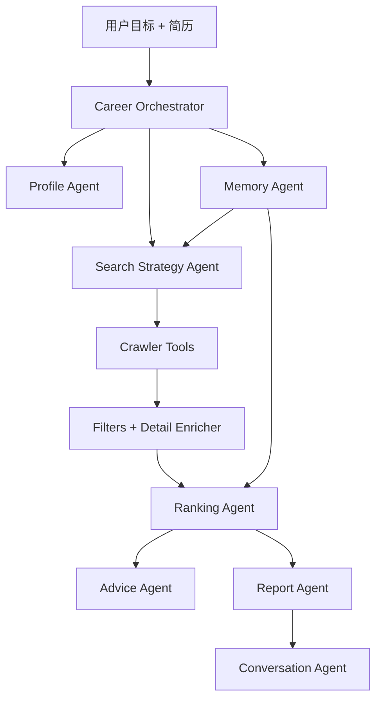

# CareerPilot Agent 开发计划与路线图

> 当前日期：2026-05-20
> 当前状态：Agent MVP 已跑通，下一步进入界面产品化和项目发布打磨

## 1. 产品定位

CareerPilot Agent 是一个面向中文招聘市场的个人求职智能体。它不是单纯的爬虫脚本，而是围绕“上传简历、说出目标、让 Agent 帮你找岗位并解释下一步”的求职操作台。

默认目标场景：

- 城市：上海
- 方向：AI Agent、RAG、大模型应用、LLM 工程、AI 应用开发
- 岗位类型：社招/全职
- 默认平台：智联、51job、猎聘、牛客
- 默认大模型：DeepSeek，OpenAI SDK 兼容调用方式
- 默认安全策略：不自动打开交互式浏览器，不自动打开 Boss 登录页，不绕过登录、验证码或滑块

一句话目标：

> 上传简历，说出求职目标，CareerPilot Agent 自动规划搜索、采集岗位、筛选机会、解释匹配原因、生成简历优化和面试建议，并沉淀可复盘的本地求职记忆。

## 2. 当前已实现能力

### 2.1 Agent 搜索链路

已实现目标驱动搜索：

- 用户输入一句话目标，例如“帮我找上海 AI Agent 社招，薪资 20K 以上，3 年以内，双休优先，不要实习不要校招”。
- `Search Strategy Agent` 解析城市、关键词、平台、岗位类型、薪资、经验、学历、双休偏好和排除词。
- `Career Orchestrator` 调度简历画像、记忆读取、平台采集、岗位排序、报告生成和运行记录。
- 默认城市为上海。
- 默认岗位类型为社招。
- 默认平台为 `zhilian`、`51job`、`liepin`、`nowcoder`。
- 默认不开浏览器、不触发 Boss 登录。

相关文件：

- `agents/search_strategy_agent.py`
- `agents/career_orchestrator.py`
- `crawlers/aggregator.py`
- `job_filters.py`

### 2.2 多平台岗位采集

已接入并聚合：

- 智联招聘
- 51job/前程无忧
- 猎聘
- 牛客
- Boss 非交互/显式授权/兜底方案

当前策略：

- 默认不把交互式 Boss 登录作为搜索入口。
- 平台越多时，原始候选会增加，但最终展示会继续经过去重、岗位类型、薪资、经验、学历、双休、排除词和排序筛选。
- 搜索摘要会解释每个平台抓取数、筛选后数量、最终展示数量和字段完整度。

相关文件：

- `crawlers/zhilian.py`
- `crawlers/job51.py`
- `crawlers/liepin.py`
- `crawlers/nowcoder.py`
- `crawlers/boss*.py`
- `crawlers/detail_enricher.py`

### 2.3 简历画像与岗位匹配

已实现：

- 上传 PDF、DOCX、TXT 简历后提取文本。
- 生成结构化简历画像。
- 对岗位进行本地匹配评分。
- 对岗位输出推荐等级：强推、可投、谨慎、不建议。
- 解释匹配理由、缺口、风险、简历动作和面试准备重点。
- DeepSeek 精评不可用时自动回退到本地规则建议。

相关文件：

- `agents/profile_agent.py`
- `agents/ranking_agent.py`
- `agents/advice_agent.py`
- `agents/resume_matcher.py`

### 2.4 求职记忆、运行记录和报告

已实现本地记忆：

- 简历画像
- 搜索历史
- 岗位反馈
- 投递状态
- Agent 任务运行记录
- 每次搜索的 Markdown 报告

每次 Agent 搜索会生成：

- `run_id`
- 执行步骤
- 搜索计划
- 平台质量摘要
- 推荐分布
- Top 岗位摘要
- 报告路径

相关文件：

- `memory/store.py`
- `agents/memory_agent.py`
- `agents/report_agent.py`
- `agents/conversation_agent.py`

### 2.5 交互界面和 CLI

已实现 Streamlit 前端：

- Agent 目标输入
- 简历上传
- 搜索计划展示
- Agent 执行步骤
- 求职记忆摘要
- 岗位表格视图
- 岗位卡片视图
- Agent 搜索报告下载
- 最近 Agent 任务
- 基于当前结果的 Agent 问答
- 单岗位简历优化和面试建议

已实现 CLI：

- `python cli.py agent-search "..."`
- `python cli.py agent-runs --limit 5`
- `python cli.py agent-ask "为什么结果这么少"`
- `python cli.py llm-status --test`
- `python cli.py crawl ...`
- `python cli.py match-resume ...`
- `python cli.py advise-resume ...`

相关文件：

- `app.py`
- `cli.py`

### 2.6 DeepSeek 默认配置

当前默认大模型配置：

- provider：`deepseek`
- model：`deepseek-v4-flash`
- base_url：`https://api.deepseek.com`
- API Key 来源：优先 `config.local.yaml`，也支持环境变量

真实 Key 只放本地，不提交 GitHub。

相关文件：

- `llm_client.py`
- `config.yaml`
- `config.local.yaml`（本地私密文件，已被 `.gitignore` 忽略）

## 3. 当前架构



核心思想：

- Orchestrator 负责任务编排。
- Search Strategy Agent 负责把自然语言目标变成可执行搜索计划。
- Crawler Tools 负责多平台采集和字段补全。
- Ranking Agent 负责推荐等级和风险解释。
- Advice Agent 负责单岗位行动建议。
- Memory Agent 负责让系统记住用户画像、反馈和投递进展。
- Report/Conversation Agent 负责让结果可复盘、可追问。

## 4. 数据与隐私边界

本地私密数据不上传 GitHub：

```text
config.local.yaml
data/jobs.db
data/memory/
data/outputs/
data/.browser_profiles/
data/.boss_browser_profile/
```

提交到 GitHub 的只应该是：

- 源码
- 示例配置
- 文档
- 依赖声明
- 不含真实个人信息的模板或占位数据

原则：

- API Key 不写入代码。
- 不提交真实简历、搜索记录、岗位数据库和浏览器 Cookie。
- 不绕过招聘平台登录、验证码、滑块或安全策略。
- 平台没有公开的字段必须标记未知，不能编造。

## 5. 已完成里程碑

| 阶段 | 内容 | 状态 |
| --- | --- | --- |
| Phase 1 | Agent 骨架：Search Strategy Agent + Career Orchestrator | 已完成 |
| Phase 2 | 简历画像：Profile Agent + 本地画像存储 | 已完成 |
| Phase 3 | 岗位决策：Ranking Agent + 推荐等级 + 风险解释 | 已完成 |
| Phase 4 | 行动建议：Advice Agent + 简历优化 + 面试建议 | 已完成 |
| Phase 5 | 求职记忆：Memory Store + 反馈/投递/搜索历史 | 已完成 |
| Phase 5.5 | 报告与问答：Report Agent + Conversation Agent + run_id | 已完成 |
| Phase 6 | 初版 Streamlit 操作台：表格/卡片/报告/问答 | 已完成 |
| Phase 7 | 项目独立化：重命名、README、GitHub 发布 | 进行中 |

## 6. 下一步路线图

### Phase 7：项目独立化完善

目标：让仓库从旧项目彻底变成 CareerPilot Agent。

待做：

- 清理旧 Demo 脚本或移动到 `legacy/`。
- 增加演示截图。
- 增加最小示例数据，不包含真实用户隐私。
- 补充 GitHub 首页说明和安全边界。
- 给核心模块补少量单元测试。

验收：

- 新用户打开 README 能直接理解这是 Agent 项目。
- `PLAN.md`、`docs/PRODUCT_DESIGN.md`、`README.md`、`skill/SKILL.md` 口径一致。
- 仓库不包含真实 API Key、真实简历、浏览器 Cookie 或本地数据库。

### Phase 8：界面产品化

目标：把 Streamlit 从“能用”升级成“像产品”。

待做：

- 三栏布局：左侧目标和筛选，中间岗位结果，右侧 Agent 解释和行动建议。
- 条件变化提示：当用户改平台、页数、筛选条件时，明确标记当前结果是否来自上一次搜索。
- 更清晰的搜索过程：展示每个平台抓取、合并、过滤、最终展示数量。
- 岗位详情面板：公司地址、经验、学历、双休、福利、风险、推荐理由放到同一处。
- 报告下载和最近任务入口更醒目。

验收：

- 用户可以自然完成“上传简历 → 输入目标 → 搜索 → 看推荐 → 生成建议 → 记录状态”。
- 改动平台、页数或筛选条件后，界面能明确提示是否需要重新搜索。

### Phase 9：面试准备工作台

目标：把“单岗位建议”扩展成真正的面试准备系统。

待做：

- 按岗位生成技能树。
- 生成针对岗位的面试题。
- 生成项目追问清单。
- 生成 30 秒/1 分钟自我介绍。
- 记录练习结果和薄弱点。
- 后续支持多轮模拟面试。

验收：

- 选择一个岗位后，用户能得到一份可执行的面试准备包。
- 建议只基于简历事实和岗位要求，不编造经历。

### Phase 10：更强 Agent Loop

目标：让 Agent 不只是一次性执行，而是能在多轮对话里持续调整策略。

待做：

- 根据用户反馈调整关键词、平台和筛选条件。
- 支持“为什么不推荐这个岗位”“把这个岗位加入对比”“按通勤重新排序”等追问。
- 支持一轮任务内多次重排和解释。
- 支持从运行报告中恢复上下文。

验收：

- 用户能围绕一次搜索连续追问，不需要反复手动整理上下文。

### Phase 11：可选部署与自动化

目标：在不牺牲隐私和安全的前提下，提供更稳定的运行方式。

待做：

- 本地部署文档。
- 可选定时搜索。
- 可选消息提醒。
- 可选 MCP 工具完善。
- 可选 Docker 化。

暂不做：

- 自动批量投递。
- 自动代聊 HR。
- 绕过登录、验证码或滑块。
- 云端多用户和付费系统。

## 7. 当前限制与风险

| 风险 | 表现 | 当前策略 |
| --- | --- | --- |
| 平台反爬 | 结果少、字段缺失、详情页失败 | 展示字段完整度和失败状态，不伪造 |
| 登录限制 | Boss 或部分详情字段拿不到 | 默认不登录，只在用户显式授权后尝试 |
| 平台选择越多但结果不增 | 去重和筛选后最终候选变少 | 报告中展示原始抓取、筛选后和最终分布 |
| 双休字段缺失 | 列表页不公开或详情页受限 | 标记未知，给出风险说明 |
| LLM 不稳定 | API Key、网络、额度问题 | DeepSeek 默认，失败后回退本地规则建议 |
| 简历建议编造 | 模型可能扩写过度 | 零编造原则，只基于简历事实给建议 |

## 8. 测试与验证清单

基础验证：

```powershell
python -m compileall app.py cli.py agents memory crawlers mcp_server
python cli.py llm-status --test
```

Agent 搜索：

```powershell
python cli.py agent-search "帮我找上海 AI Agent 社招，薪资 20K 以上，3 年以内，双休优先，不要实习不要校招。"
python cli.py agent-runs --limit 5
python cli.py agent-ask "为什么结果这么少"
```

前端验证：

```powershell
streamlit run app.py
```

需要人工检查：

- 前端默认城市是否为上海。
- 默认岗位类型是否为社招。
- 默认平台是否为智联、51job、猎聘、牛客。
- 搜索前后页面结果是否对应当前条件。
- 报告是否展示平台抓取量、筛选量、最终量和字段完整度。
- 本地私密文件是否没有进入 Git。

## 9. 文档维护规则

以后每次新增能力，都同步更新：

- `README.md`：面向使用者，说明能做什么、怎么启动、怎么配置。
- `PLAN.md`：面向开发者，说明当前状态、路线图和风险。
- `docs/PRODUCT_DESIGN.md`：面向产品设计，说明交互、模块和验收标准。
- `docs/PHASE1_AGENT_SCAFFOLD.md`：保留 Agent 骨架阶段的实现记录。
- `skill/SKILL.md`：面向 Skill 使用者，说明当前命令和限制。

文档禁止再出现以下过期默认口径：

- 非 DeepSeek 模型作为默认模型。
- 非上海社招作为默认目标场景。
- 把自动批量投递写成 MVP 能力。
- 把旧 Skill 框架写成当前发布目标。
- 默认自动打开 Boss 登录浏览器。
