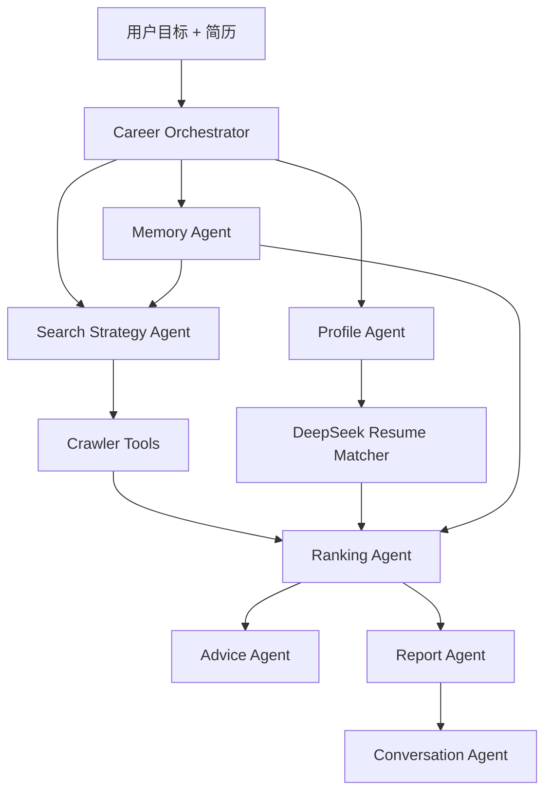

# CareerPilot Agent


CareerPilot Agent 是一个面向中文招聘市场的个人求职智能体原型。它围绕“上传简历、说出目标、规划搜索、采集岗位、匹配简历、解释推荐、生成面试建议、沉淀求职记忆”这一条主流程，帮助求职者把多个招聘平台和简历文档里的信息收束到一个本地工作台。

本项目当前定位为个人项目 / 本地 MVP / GitHub 展示系统：适合用于流程验证、AI 应用工程化练习和面试项目展示，不建议包装成已经大规模生产落地的招聘平台或自动投递系统。

> 使用说明：默认目标场景为上海 / AI Agent、RAG、大模型应用方向；社招和校招可选，默认排除实习。交互式招聘平台页面默认不自动打开，需要时由用户手动开启。

> 仓库说明：本地配置、运行资料、生成报告和个人求职记录只作为本地演示资料使用，公开仓库只保留源码、文档和示例配置。

## 现在能做什么

- 用一句话启动 Agent 搜索：例如“帮我找上海 AI Agent 岗位，我是去年毕业的，薪资 20K 以内，社招和校招都可以，双休优先，不要实习。”
- 自动生成搜索计划：城市、关键词组合、平台、岗位类型、薪资、经验、学历、双休偏好、排除词；自然语言里的“20K 以内”默认按偏好排序，不会像手动筛选那样硬砍候选。
- `双休优先` 和根据毕业时间推断的经验偏好默认只参与排序和风险提示；只有明确写出“只看双休”或经验上限时才会作为硬筛选。
- 多平台采集岗位：默认展示 BOSS直聘、智联招聘、前程无忧；也可手动选择猎聘、拉勾、牛客网、应届生、国聘网、丁香人才网、就业在线等平台。
- 默认看社招和校招，排除实习；也可以手动选择只看社招、校招或实习。
- 返回字段更完整的岗位结果：公司、岗位、薪资、经验、学历、公司地址、双休/福利、来源、链接。
- 上传简历后自动解析简历画像，并用文件名 + 文本 hash 做缓存，刷新页面不会重复解析同一份简历。
- 简历匹配采用两阶段策略：先用本地规则快速匹配全部岗位并立即刷新结果，再默认用 DeepSeek 对本地 Top 3 做精准匹配，输出推荐分和推荐等级：强推、推荐、可投、谨慎、备选、不建议。
- DeepSeek 精排支持缓存和失败兜底：同一份简历 + 同一岗位不会重复请求；超时、报错或返回异常时自动保留本地评分，不阻塞展示。
- 对每个岗位解释匹配证据、缺失能力、风险点、简历动作和面试准备重点；DeepSeek 不可用时自动退回本地规则评分。
- 针对单个岗位生成 JD/简历差距分析：岗位核心要求、已覆盖内容、缺失内容、项目表达、技术栈补强和投递风险。
- 针对单个岗位生成面试准备包：岗位理解、简历追问、技术题、项目深挖、行为面、反问建议和 7 天准备清单。
- 结果区支持表格和卡片视图，卡片默认分页显示，避免一次刷太多。
- 普通界面默认不展示原始 JSON，所有 AI 结果会收束成中文可读卡片；原始结构只保留在默认关闭的“开发者调试信息”里。
- 生成 Agent 搜索报告 Markdown，记录搜索计划、平台质量、字段完整度、DeepSeek 精排数量、Top 岗位和下一步行动。
- 保存 Agent 运行记录：`run_id`、执行步骤、推荐分布、Top 岗位摘要、报告路径。
- 支持本地 Agent 问答：为什么结果少、优先投哪个、双休为什么缺、下一步做什么。
- 保存本地求职记忆：简历画像、岗位反馈、投递状态、搜索历史。

## 与原工具的区别

| 维度 | 旧式岗位工具 | CareerPilot Agent |
| --- | --- | --- |
| 交互方式 | 用户手动配关键词和平台 | 用户输入目标，Agent 制定搜索计划 |
| 结果展示 | 岗位表格 | 表格 + 卡片 + 推荐解释 |
| 简历匹配 | 分数和关键词 | 上传即解析、两阶段匹配、DeepSeek Top 3 精排、结构化证据 |
| 面试准备 | 无 | JD 差距分析 + 面试准备包 |
| 数据质量 | 只返回结果 | 解释平台数量、字段完整度、详情抓取限制 |
| 记忆能力 | 一次性搜索 | 搜索历史、反馈、投递状态、运行报告 |
| 安全策略 | 可能自动打开浏览器 | Boss 登录浏览器默认关闭，需要时手动开启 |

## 快速开始

### 1. 安装依赖

```powershell
git clone https://github.com/anan-root/careerpilot-agent.git
cd careerpilot-agent
python -m venv .venv
.\.venv\Scripts\activate
pip install -r requirements.txt
```

### 2. 配置 DeepSeek

复制 `config.yaml` 为 `config.local.yaml`，把真实 API Key 放在本地文件或环境变量里。不要把真实 Key 提交到 GitHub。

```yaml
llm:
  provider: deepseek
  model: deepseek-v4-flash
  base_url: https://api.deepseek.com
  api_key: ${DEEPSEEK_API_KEY}
```

如果你在 `config.local.yaml` 里改了 `model`，以本地配置为准。

PowerShell 设置环境变量示例：

```powershell
$env:DEEPSEEK_API_KEY="你的 DeepSeek API Key"
```

### 3. 启动前端

```powershell
streamlit run app.py
```

前端入口包括：

- Agent 求职目标：一句话输入目标并检索。
- 简历上传：上传后自动解析画像；同一份简历会命中缓存。
- 岗位结果：表格/卡片视图切换。
- Agent 计划与解释：搜索计划、执行步骤、求职记忆、报告下载。
- Agent 问答：围绕当前搜索结果提问。
- 简历优化与面试建议：选择岗位后生成本地建议、DeepSeek 简历优化、JD 差距分析和面试准备包。
- 本地求职记忆：导出画像、反馈、投递和搜索历史。
- 岗位结果分页：默认每页 10 条，可切换页码和每页数量。
- 开发者调试信息：默认关闭，只在排查时查看原始结构化 JSON。

### 4. 使用 CLI

```powershell
python cli.py agent-search "帮我找上海 AI Agent 岗位，我是去年毕业的，薪资 20K 以内，社招和校招都可以，双休优先，不要实习。"
```

带简历搜索：

```powershell
python cli.py agent-search "找上海 RAG 工程师，20K 以上，不要外包" --resume .\resume.pdf
```

查看最近 Agent 任务：

```powershell
python cli.py agent-runs --limit 5
```

基于最近一次搜索提问：

```powershell
python cli.py agent-ask "为什么结果这么少"
python cli.py agent-ask "优先投哪个"
python cli.py agent-ask "双休为什么获取不到"
```

指定任务提问：

```powershell
python cli.py agent-ask "下一步怎么做" --run-id 20260518_223632_d1a35c2a
```

普通多平台采集：

```powershell
python cli.py crawl -k "AI Agent" -l "上海" -p boss -p zhilian -p 51job --pages 2 --job-type 社招
```

导出岗位：

```powershell
python cli.py export -f excel
python cli.py export -f all --all-columns
```

## Agent 工作流



每次 Agent 搜索都会经历：

1. 创建 Agent 任务，生成 `run_id`。
2. 读取上传简历或本地画像。
3. 读取本地求职记忆。
4. 生成 SearchPlan。
5. 调用多平台检索。
6. 上传简历时自动解析并缓存画像；同一份简历不会重复解析。
7. 先对全部岗位做本地快速匹配并立即排序展示。
8. 默认只对本地 Top 3 岗位调用 DeepSeek 精排，并缓存同一份简历 + 岗位的精排结果。
9. 对岗位排序并生成推荐判断。
10. 保存 Markdown 报告和运行记录。
11. 支持基于结果的本地问答、JD 差距分析和面试准备包。

## 数据与输出位置

```text
data/
  jobs.db                         # SQLite 岗位库
  memory/
    profile.json                  # 简历画像
    search_history.jsonl          # 搜索历史
    job_feedback.jsonl            # 岗位反馈
    applications.jsonl            # 投递记录
    agent_runs/*.json             # 每次 Agent 任务记录
  outputs/
    agent_search_report.md        # 最近一次 Agent 搜索报告
    agent_runs/*.md               # 按 run_id 归档的搜索报告
    resume_job_match_report.md    # 简历匹配报告
```

## 主要模块

```text
agents/
  career_orchestrator.py          # Agent 总调度
  search_strategy_agent.py        # 自然语言目标解析和搜索计划
  profile_agent.py                # 简历画像
  ranking_agent.py                # 岗位推荐决策
  advice_agent.py                 # 单岗位本地行动建议
  memory_agent.py                 # 求职记忆摘要
  report_agent.py                 # Markdown 搜索报告
  conversation_agent.py           # 本地搜索结果问答
  resume_matcher.py               # 简历解析、匹配、DeepSeek 建议
  prompt_loader.py                 # Prompt 文件加载与占位符渲染

prompts/
  resume_profile.md                # 简历画像解析 Prompt
  job_match.md                     # 简历-JD 精准匹配 Prompt
  job_gap_analysis.md              # JD 差距分析 Prompt
  interview_pack.md                # 面试准备包 Prompt

crawlers/
  aggregator.py                   # 多平台聚合、去重、字段质量摘要
  zhilian.py                      # 智联招聘
  job51.py                        # 51job/前程无忧
  liepin.py                       # 猎聘
  nowcoder.py                     # 牛客
  generic_platforms.py            # 拉勾/应届生/国聘网/丁香人才网/就业在线搜索入口
  boss*.py                        # Boss 非交互/登录浏览器/兜底方案

memory/
  store.py                        # JSON/JSONL 本地记忆和 Agent 任务记录
```

## 安全策略

- API Key 不写入代码，优先使用 `config.local.yaml` 或环境变量。
- `config.local.yaml` 属于本地私密配置，不应提交。
- Boss 登录浏览器默认关闭，需要时手动勾选“允许打开 Boss 登录浏览器”。
- 勾选后，BOSS 直聘会复用同一个浏览器窗口完成登录和多个关键词搜索，不会每个关键词重新开窗。
- 如果你在 Agent 目标里明确写“允许 Boss 登录浏览器”，Agent 也会尝试启用这条路径。
- BOSS 登录态由平台控制，可能因为 Cookie 过期、短信/验证码校验或安全风控失效。
- Boss 登录浏览器会尽量做软判断和重试；如果状态不稳，不会直接把浏览器关掉，而是保留窗口等待你手动恢复。
- 普通 `boss` 检索保持非交互模式；只有手动允许并选择 `boss_drission` 才会启动 Boss 登录浏览器。
- 前程无忧/猎聘浏览器列表采集默认关闭，只有显式启用才运行。
- 不绕过登录、验证码、滑块或平台安全策略。
- 双休、地址、经验等字段如果平台未公开或详情页被验证拦截，会标记为未知，不会编造。
- MVP 不做自动投递和自动代聊 HR。

## 常见问题

### 为什么平台选得越多，最终显示可能更少？

平台增多会增加原始候选，但最终展示还会经过去重、社招/校招/实习过滤、薪资、学历、明确经验上限、明确双休硬筛、排除词和推荐排序。`双休优先` 与毕业时间推断出的经验偏好只影响排序，不会单独把结果清空。搜索摘要会显示每个平台抓取、筛选和最终展示数量。

### 为什么获取不到双休、经验或公司地址？

这些字段取决于平台是否在列表页公开。部分平台把福利、详细地址、完整经验要求放在详情页，详情页又可能需要登录、滑块或验证。CareerPilot Agent 会尝试记录字段完整度，但不会为了填字段而编造信息。

### 为什么 Boss 登录态会失效？

BOSS 的登录态不是项目自己签发的。平台可能根据 Cookie 有效期、设备环境、访问频率、验证码或安全风控要求重新登录，所以同一个浏览器配置也不能保证长期稳定在线。CareerPilot Agent 不会自动绕过这些校验；需要 BOSS 登录浏览器时请手动开启，并在失效后按平台页面重新完成登录。现在浏览器路径会先做软判断、再重试一次，登录态不稳时也会尽量保留窗口，避免一误判就退出。

### 为什么上传简历后匹配不会一直卡住？

现在匹配被拆成两阶段：本地规则先对全部岗位快速评分，结果会先展示出来；DeepSeek 默认只精排本地 Top 3，并且有缓存和失败兜底。即使 DeepSeek 超时或返回异常，页面也会保留本地评分，不会因为模型调用把整轮搜索卡住。

### 为什么界面看不到 JSON 了？

普通使用不需要看原始结构。简历画像、匹配证据、缺失能力、风险点、简历动作和面试重点都会以中文可读卡片展示。原始 JSON 只保留在默认关闭的“开发者调试信息”里，方便开发排查。

### 为什么登录后又回到主页面？

以前的实现会按关键词反复启动 Boss 浏览器，所以看起来像“登录完又开新页”。现在已经改成同一轮搜索复用一个窗口，先确认登录态，再继续抓岗位接口，能明显减少这种反复跳转。

### 如何让结果更多？

- 把每个平台页数调到 2-3。
- 增加关键词数量。
- 放宽薪资范围或明确写出的经验上限。
- 如果手动开启了“只看公开双休/待确认工作制”，先关闭这个硬筛选。
- 保留“不要实习”，避免结果被实习岗位污染。

## 开发路线

当前已完成：

- Agent 搜索计划、岗位检索、推荐排序、岗位解释、简历建议、本地记忆。
- 上传简历后的 DeepSeek 精排、结构化 `ai_match`、JD 差距分析和面试准备包。
- 上传即解析简历画像、简历画像缓存、岗位精排缓存和失败兜底。
- Prompt 文件化管理，核心提示词集中在 `prompts/`。
- Boss 登录浏览器授权、软判断、单会话复用。
- 岗位卡片/表格视图、分页、字段完整度摘要、中文可读 AI 结果展示。

下一步建议：

- 更强的 Agent 对话：基于当前报告和岗位列表进行多轮解释。
- 面试准备工作台：题库沉淀、模拟问答、复盘计划。
- 详情页按需补全：用户打开某个岗位时再抓详情，减少搜索阶段等待。
- 项目独立化发布、截图、示例数据、演示脚本。

## License

MIT

