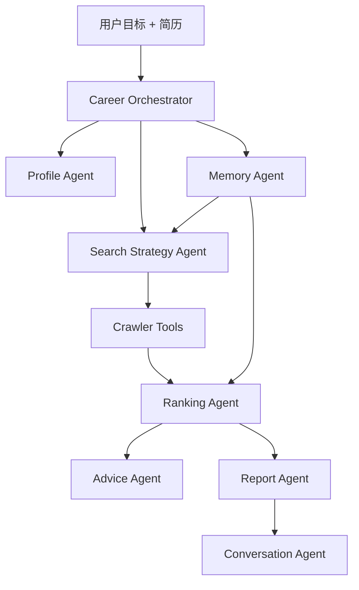

# CareerPilot Agent

面向中文招聘市场的个人求职智能体。上传简历，说出目标，Agent 会规划搜索、采集岗位、解释结果、给出推荐决策、生成行动建议，并把每次求职任务记录成可复盘的本地记忆。

> 默认目标场景：上海 / AI Agent、RAG、大模型应用方向 / 社招全职。
> 默认安全策略：不自动打开浏览器，不自动打开 Boss 登录页，不绕过登录、验证码或滑块。

## 现在能做什么

- 用一句话启动 Agent 搜索：例如“帮我找上海 AI Agent 社招，薪资 20K 以上，3 年以内，双休优先，不要实习不要校招。”
- 自动生成搜索计划：城市、关键词组合、平台、岗位类型、薪资、经验、学历、双休、排除词。
- 多平台采集岗位：智联、51job、猎聘、牛客，Boss 默认只走非交互方式或兜底方式。
- 默认过滤实习和校招，只看社招/全职；也可以手动选择社招、校招、实习。
- 返回字段更完整的岗位结果：公司、岗位、薪资、经验、学历、公司地址、双休/福利、来源、链接。
- 根据简历画像和岗位条件输出推荐等级：强推、可投、谨慎、不建议。
- 对每个岗位解释匹配理由、风险点、简历动作和面试准备重点。
- 生成 Agent 搜索报告 Markdown，记录搜索计划、平台质量、字段完整度、Top 岗位和下一步行动。
- 保存 Agent 运行记录：`run_id`、执行步骤、推荐分布、Top 岗位摘要、报告路径。
- 支持本地 Agent 问答：为什么结果少、优先投哪个、双休为什么缺、下一步做什么。
- 保存本地求职记忆：简历画像、岗位反馈、投递状态、搜索历史。

## 与原工具的区别

| 维度 | 旧式岗位工具 | CareerPilot Agent |
| --- | --- | --- |
| 交互方式 | 用户手动配关键词和平台 | 用户输入目标，Agent 制定搜索计划 |
| 结果展示 | 岗位表格 | 表格 + 卡片 + 推荐解释 |
| 简历匹配 | 分数和关键词 | 画像、项目、风险、简历动作、面试重点 |
| 数据质量 | 只返回结果 | 解释平台数量、字段完整度、详情抓取限制 |
| 记忆能力 | 一次性搜索 | 搜索历史、反馈、投递状态、运行报告 |
| 安全策略 | 可能自动打开浏览器 | 默认不打开浏览器，Boss 登录必须显式授权 |

## 快速开始

### 1. 安装依赖

```powershell
git clone https://github.com/anan-root/careerpilot-agent.git
cd careerpilot-agent
python -m venv .venv
.\.venv\Scripts\activate
pip install -r requirements.txt
```

### 2. 配置 DeepSeek

复制 `config.yaml` 为 `config.local.yaml`，把真实 API Key 放在本地文件或环境变量里。不要把真实 Key 提交到 GitHub。

```yaml
llm:
  provider: deepseek
  model: deepseek-v4-flash
  base_url: https://api.deepseek.com
  api_key: ${DEEPSEEK_API_KEY}
```

PowerShell 设置环境变量示例：

```powershell
$env:DEEPSEEK_API_KEY="你的 DeepSeek API Key"
```

### 3. 启动前端

```powershell
streamlit run app.py
```

前端入口包括：

- Agent 求职目标：一句话输入目标并检索。
- 岗位结果：表格/卡片视图切换。
- Agent 计划与解释：搜索计划、执行步骤、求职记忆、报告下载。
- Agent 问答：围绕当前搜索结果提问。
- 简历优化与面试建议：选择岗位后生成本地建议或 DeepSeek 建议。
- 本地求职记忆：导出画像、反馈、投递和搜索历史。

### 4. 使用 CLI

```powershell
python cli.py agent-search "帮我找上海 AI Agent 社招，薪资 20K 以上，3 年以内，双休优先，不要实习不要校招。"
```

带简历搜索：

```powershell
python cli.py agent-search "找上海 RAG 工程师，20K 以上，不要外包" --resume .\resume.pdf
```

查看最近 Agent 任务：

```powershell
python cli.py agent-runs --limit 5
```

基于最近一次搜索提问：

```powershell
python cli.py agent-ask "为什么结果这么少"
python cli.py agent-ask "优先投哪个"
python cli.py agent-ask "双休为什么获取不到"
```

指定任务提问：

```powershell
python cli.py agent-ask "下一步怎么做" --run-id 20260518_223632_d1a35c2a
```

普通多平台采集：

```powershell
python cli.py crawl -k "AI Agent" -l "上海" -p zhilian -p 51job -p liepin --pages 2 --job-type 社招
```

导出岗位：

```powershell
python cli.py export -f excel
python cli.py export -f all --all-columns
```

## Agent 工作流



每次 Agent 搜索都会经历：

1. 创建 Agent 任务，生成 `run_id`。
2. 读取上传简历或本地画像。
3. 读取本地求职记忆。
4. 生成 SearchPlan。
5. 调用多平台检索。
6. 对岗位排序并生成推荐判断。
7. 保存 Markdown 报告和运行记录。
8. 支持基于结果的本地问答。

## 数据与输出位置

```text
data/
  jobs.db                         # SQLite 岗位库
  memory/
    profile.json                  # 简历画像
    search_history.jsonl          # 搜索历史
    job_feedback.jsonl            # 岗位反馈
    applications.jsonl            # 投递记录
    agent_runs/*.json             # 每次 Agent 任务记录
  outputs/
    agent_search_report.md        # 最近一次 Agent 搜索报告
    agent_runs/*.md               # 按 run_id 归档的搜索报告
    resume_job_match_report.md    # 简历匹配报告
```

## 主要模块

```text
agents/
  career_orchestrator.py          # Agent 总调度
  search_strategy_agent.py        # 自然语言目标解析和搜索计划
  profile_agent.py                # 简历画像
  ranking_agent.py                # 岗位推荐决策
  advice_agent.py                 # 单岗位本地行动建议
  memory_agent.py                 # 求职记忆摘要
  report_agent.py                 # Markdown 搜索报告
  conversation_agent.py           # 本地搜索结果问答
  resume_matcher.py               # 简历解析、匹配、DeepSeek 建议

crawlers/
  aggregator.py                   # 多平台聚合、去重、字段质量摘要
  zhilian.py                      # 智联招聘
  job51.py                        # 51job/前程无忧
  liepin.py                       # 猎聘
  nowcoder.py                     # 牛客
  boss*.py                        # Boss 非交互/显式授权/兜底方案

memory/
  store.py                        # JSON/JSONL 本地记忆和 Agent 任务记录
```

## 安全策略

- API Key 不写入代码，优先使用 `config.local.yaml` 或环境变量。
- `config.local.yaml` 属于本地私密配置，不应提交。
- 默认不启动交互式浏览器。
- 默认不打开 Boss 登录页。
- `boss_drission` 只有在用户显式选择或设置 `allow_browser_login=True` 时才允许打开登录浏览器。
- 51job/猎聘浏览器列表采集默认关闭，只有显式启用才运行。
- 不绕过登录、验证码、滑块或平台安全策略。
- 双休、地址、经验等字段如果平台未公开或详情页被验证拦截，会标记为未知，不会编造。
- MVP 不做自动投递和自动代聊 HR。

## 常见问题

### 为什么平台选得越多，最终显示可能更少？

平台增多会增加原始候选，但最终展示还会经过去重、社招/校招/实习过滤、薪资、经验、学历、双休、排除词和推荐排序。结果表展示的是“符合条件的最终候选”，不是原始抓取总量。搜索摘要会显示每个平台抓取、筛选和最终展示数量。

### 为什么获取不到双休、经验或公司地址？

这些字段取决于平台是否在列表页公开。部分平台把福利、详细地址、完整经验要求放在详情页，详情页又可能需要登录、滑块或验证。CareerPilot Agent 会尝试记录字段完整度，但不会为了填字段而编造信息。

### 为什么默认不打开 Boss 浏览器？

因为浏览器登录属于高打扰、高不确定的动作。现在默认使用安全模式，不自动打开浏览器。需要 Boss 登录数据时，必须由用户显式授权。

### 如何让结果更多？

- 把每个平台页数调到 2-3。
- 增加关键词数量。
- 先取消双休优先。
- 放宽薪资下限或经验上限。
- 保留“不要实习/不要校招”，避免结果被实习岗位污染。

## 开发路线

当前已完成：

- Phase 1：Agent 骨架。
- Phase 2：简历画像与匹配升级。
- Phase 3：岗位决策 Agent。
- Phase 4：单岗位行动建议。
- Phase 5：本地求职记忆。
- Agent 搜索报告、运行记录、本地问答、岗位卡片视图。

下一步建议：

- Phase 6：三栏式产品化界面。
- Phase 7：项目独立化发布、截图、示例数据、演示脚本。
- 更强的 Agent 对话：基于当前报告和岗位列表进行多轮解释。
- 面试准备工作台：题库、追问、复盘计划。

## License

MIT

