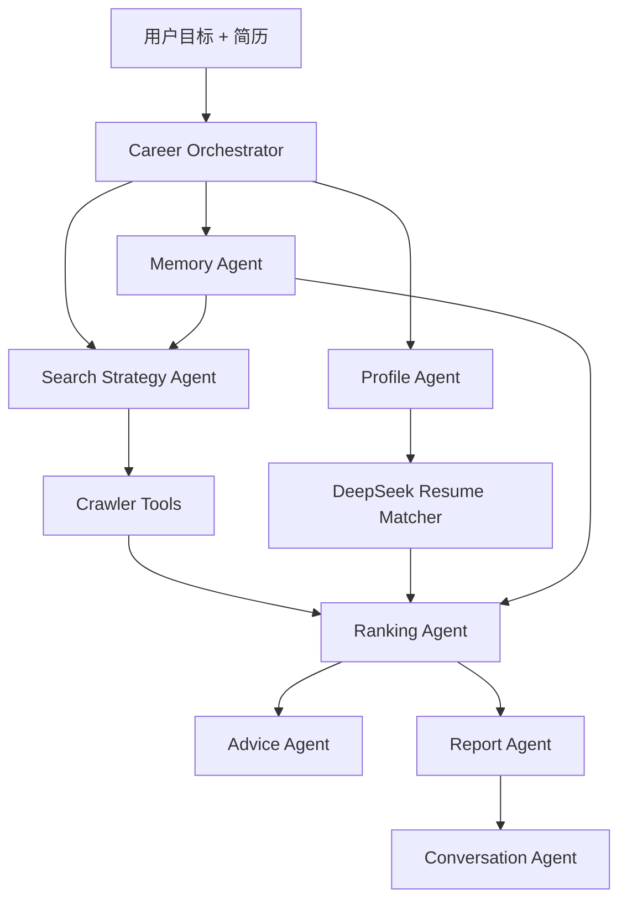

# CareerPilot Agent


CareerPilot Agent 是一个面向中文招聘市场的个人求职工作台。它围绕“上传简历、说出目标、规划搜索、采集岗位、匹配简历、解释推荐、记录投递、沉淀求职记忆”这一条主流程，把多个招聘平台和简历文档里的信息收束到一个本地产品原型里。

项目当前已经形成五个可运行入口：

- `app.py`：Streamlit 求职工作台，覆盖任务配置、岗位结果、沟通行动和记录记忆。
- `api.py`：FastAPI 本地接口，供插件、脚本和独立前端调用。
- `frontend/`：Vite + Vue 独立 Web 前端，覆盖岗位采集、导入、匹配和动作记录。
- `browser_extension/`：Chrome / Edge 插件雏形，用于从岗位详情页导入当前页面。
- `cli.py`：命令行入口，支持 Agent 搜索、岗位采集、导入、匹配和报告导出。

> 默认目标场景为上海 / AI Agent、RAG、大模型应用方向；社招和校招可选，默认排除实习。交互式招聘平台页面默认不自动打开，需要时由用户手动开启。

> 仓库说明：本地配置、运行资料、生成报告和个人求职记录只作为本地演示资料使用，公开仓库只保留源码、文档和示例配置。

## 现在能做什么

- 用一句话启动 Agent 搜索：例如“帮我找上海 AI Agent 岗位，我是去年毕业的，薪资 20K 以内，社招和校招都可以，双休优先，不要实习。”
- 支持自然语言求职任务：用户可以把搜索条件、筛选规则、简历匹配要求和沟通边界写成一句话，系统先解析为可编辑任务草稿，再由用户保存或执行。
- 自动生成搜索计划：城市、关键词组合、平台、岗位类型、薪资、经验、学历、双休偏好、排除词；自然语言里的“20K 以内”默认按偏好排序，不会像手动筛选那样硬砍候选。
- 任务配置支持城市、平台、岗位类型、正则包含/排除、匹配阈值、BOSS 打招呼字数、打招呼提示词和回复提示词；任务保存在本地 JSON，不改 SQLite。
- `双休优先` 和根据毕业时间推断的经验偏好默认只参与排序和风险提示；只有明确写出“只看双休”或经验上限时才会作为硬筛选。
- 多平台采集岗位：默认展示 BOSS直聘、智联招聘、前程无忧；也可手动选择猎聘、拉勾、牛客网、应届生、国聘网、丁香人才网、就业在线等平台。
- 支持外部岗位导入：可以在前端粘贴 JD、填写岗位链接，或让系统尝试读取链接页面正文后统一入库。
- 导入岗位会根据链接识别 BOSS、智联、前程无忧、猎聘等来源，并尽量抽取岗位、公司、地点和薪资字段。
- 提供本地 FastAPI 接口：`/jobs/search`、`/jobs/import`、`/jobs/match` 可供浏览器插件、脚本或独立前端调用。
- 提供浏览器插件雏形：用户在岗位详情页点击插件，将当前页文本导入本地 CareerPilot，也可以先收藏岗位。
- 提供岗位动作 API：收藏、反馈、投递状态和动作记录可通过本地 API 写入求职记忆。
- 默认看社招和校招，排除实习；也可以手动选择只看社招、校招或实习。
- 返回字段更完整的岗位结果：公司、岗位、薪资、经验、学历、公司地址、双休/福利、来源、链接。
- 采集结果带质量控制：字段置信度、质量等级、无效候选过滤、去重原因和采集质量摘要会进入搜索质量区。
- 上传简历后自动解析简历画像，并用文件名 + 文本 hash 做缓存，刷新页面不会重复解析同一份简历。
- 简历匹配采用两阶段策略：先用本地规则快速匹配全部岗位并立即刷新结果，再默认用 DeepSeek 对本地 Top 3 做精准匹配，输出推荐分和推荐等级：强推、推荐、可投、谨慎、备选、不建议。
- DeepSeek 精排支持缓存和失败兜底：同一份简历 + 同一岗位不会重复请求；超时、报错或返回异常时自动保留本地评分，不阻塞展示。
- 对每个岗位解释匹配证据、缺失能力、风险点、简历动作和面试准备重点；DeepSeek 不可用时自动退回本地规则评分。
- 岗位结果区提供匹配看板：展示平均匹配分、强匹配岗位、平台分布、Top 岗位、主要命中和主要缺口，并支持 JSON 下载。
- 收藏、反馈和投递记录会回流到匹配结果；已标记不合适的公司会在本地匹配中降权。
- 针对单个岗位生成 JD/简历差距分析：岗位核心要求、已覆盖内容、缺失内容、项目表达、技术栈补强和投递风险。
- 针对单个岗位生成面试准备包：岗位理解、简历追问、技术题、项目深挖、行为面、反问建议和 7 天准备清单。
- 结果区支持表格和卡片视图，卡片默认分页显示，避免一次刷太多。
- 普通界面默认不展示原始 JSON，所有 AI 结果会收束成中文可读卡片；原始结构只保留在默认关闭的“开发者调试信息”里。
- 生成 Agent 搜索报告 Markdown，记录搜索计划、平台质量、字段完整度、DeepSeek 精排数量、Top 岗位和下一步行动。
- 保存 Agent 运行记录：`run_id`、执行步骤、推荐分布、Top 岗位摘要、报告路径。
- 支持本地 Agent 问答：为什么结果少、优先投哪个、双休为什么缺、下一步做什么。
- 保存本地求职记忆：简历画像、岗位反馈、投递状态、搜索历史。
- 支持 BOSS 受控沟通：根据岗位、简历画像和任务边界生成打招呼/回复草稿，用户编辑确认后才发送；第一版只做单岗位沟通，不做批量、不上传简历、不自动代聊。
- 前端已拆成 4 个工作区：任务配置、岗位结果、沟通行动、记录记忆，避免所有控件堆在一个页面。

## 与原工具的区别

| 维度 | 旧式岗位工具 | CareerPilot Agent |
| --- | --- | --- |
| 交互方式 | 用户手动配关键词和平台 | 用户输入目标，Agent 制定搜索计划 |
| 结果展示 | 岗位表格 | 表格 + 卡片 + 推荐解释 |
| 简历匹配 | 分数和关键词 | 上传即解析、两阶段匹配、DeepSeek Top 3 精排、结构化证据 |
| 面试准备 | 无 | JD 差距分析 + 面试准备包 |
| 数据质量 | 只返回结果 | 解释平台数量、字段完整度、详情抓取限制 |
| 记忆能力 | 一次性搜索 | 搜索历史、反馈、投递状态、运行报告 |
| 沟通动作 | 用户自行复制话术 | 先生成草稿，用户确认后再执行单岗位 BOSS 沟通 |
| 运行边界 | 可能自动打开浏览器 | Boss 登录浏览器默认关闭，需要时手动开启 |

## 快速开始

### 1. 安装依赖

```powershell
git clone https://github.com/anan-root/careerpilot-agent.git
cd careerpilot-agent
python -m venv .venv
.\.venv\Scripts\activate
pip install -r requirements.txt
```

### 2. 配置 DeepSeek

复制 `config.yaml` 为 `config.local.yaml`，把真实 API Key 放在本地文件或环境变量里。不要把真实 Key 提交到 GitHub。

```yaml
llm:
  provider: deepseek
  model: deepseek-v4-flash
  base_url: https://api.deepseek.com
  api_key: ${DEEPSEEK_API_KEY}
```

如果你在 `config.local.yaml` 里改了 `model`，以本地配置为准。

PowerShell 设置环境变量示例：

```powershell
$env:DEEPSEEK_API_KEY="你的 DeepSeek API Key"
```

### 3. 启动 Streamlit 工作台

```powershell
streamlit run app.py
```

前端入口包括：

- 工作区切换：按“任务配置 / 岗位结果 / 沟通行动 / 记录记忆”分区使用。
- 自然语言任务：一句话配置搜索、筛选、匹配和沟通边界，解析后先形成可编辑草稿。
- Agent 求职目标：一句话输入目标并检索。
- 岗位导入：粘贴 JD、补充公司/岗位/薪资/地点，或尝试读取岗位链接内容。
- 简历上传：上传后自动解析画像；同一份简历会命中缓存。
- 岗位结果：表格/卡片视图切换。
- Agent 计划与解释：搜索计划、执行步骤、求职记忆、报告下载。
- Agent 问答：围绕当前搜索结果提问。
- 简历优化与面试建议：选择岗位后生成本地建议、DeepSeek 简历优化、JD 差距分析和面试准备包。
- BOSS 沟通区：选择岗位后生成打招呼或回复草稿，支持编辑、干跑检查和确认发送。
- 本地求职记忆：导出画像、反馈、投递和搜索历史。
- 岗位结果分页：默认每页 10 条，可切换页码和每页数量。
- 开发者调试信息：默认关闭，只在排查时查看原始结构化 JSON。

### 4. 启动本地 API

```powershell
python api.py
```

API 默认监听：

- `GET http://127.0.0.1:8000/health`
- `GET http://127.0.0.1:8000/meta/capabilities`
- `GET http://127.0.0.1:8000/meta/platforms`
- `POST http://127.0.0.1:8000/jobs/search`
- `POST http://127.0.0.1:8000/jobs/import`
- `GET http://127.0.0.1:8000/jobs`
- `POST http://127.0.0.1:8000/jobs/match`
- `POST http://127.0.0.1:8000/jobs/bookmark`
- `POST http://127.0.0.1:8000/jobs/feedback`
- `POST http://127.0.0.1:8000/jobs/application`
- `GET http://127.0.0.1:8000/jobs/actions`

### 5. 启动独立 Web 前端

```powershell
cd frontend
npm.cmd install
npm.cmd run dev
```

独立前端默认访问：

- `http://127.0.0.1:5173`

当前独立前端已经接入：

- 平台清单：`GET /meta/platforms`
- 多平台采集：`POST /jobs/search`
- 手动岗位导入：`POST /jobs/import`
- 简历匹配看板：`POST /jobs/match`
- 收藏、反馈、投递动作：`POST /jobs/bookmark` / `POST /jobs/feedback` / `POST /jobs/application`

### 6. 加载浏览器插件

启动 API 后，在 Chrome / Edge 扩展管理页选择“加载解压缩的扩展”，目录选 `browser_extension`。打开岗位详情页后，插件可以读取当前页面文本，并调用本地 API 导入或收藏岗位。

更完整的接口和独立前端说明见：

- `docs/API_REFERENCE.md`
- `docs/FRONTEND_PRODUCT_PLAN.md`

### 7. 使用 CLI

```powershell
python cli.py agent-search "帮我找上海 AI Agent 岗位，我是去年毕业的，薪资 20K 以内，社招和校招都可以，双休优先，不要实习。"
```

带简历搜索：

```powershell
python cli.py agent-search "找上海 RAG 工程师，20K 以上，不要外包" --resume .\resume.pdf
```

查看最近 Agent 任务：

```powershell
python cli.py agent-runs --limit 5
```

基于最近一次搜索提问：

```powershell
python cli.py agent-ask "为什么结果这么少"
python cli.py agent-ask "优先投哪个"
python cli.py agent-ask "双休为什么获取不到"
```

指定任务提问：

```powershell
python cli.py agent-ask "下一步怎么做" --run-id 20260518_223632_d1a35c2a
```

普通多平台采集：

```powershell
python cli.py crawl -k "AI Agent" -l "上海" -p boss -p zhilian -p 51job --pages 2 --job-type 社招
```

导出岗位：

```powershell
python cli.py export -f excel
python cli.py export -f all --all-columns
```

导入外部 JD：

```powershell
python cli.py import-job --jd-file .\jd.txt --url "https://example.com/job/1"
python cli.py import-job --url "https://example.com/job/1" --fetch-url
```

## Agent 工作流



每次 Agent 搜索都会经历：

1. 创建 Agent 任务，生成 `run_id`。
2. 读取上传简历或本地画像。
3. 读取本地求职记忆。
4. 生成 SearchPlan。
5. 调用多平台检索。
6. 上传简历时自动解析并缓存画像；同一份简历不会重复解析。
7. 先对全部岗位做本地快速匹配并立即排序展示。
8. 默认只对本地 Top 3 岗位调用 DeepSeek 精排，并缓存同一份简历 + 岗位的精排结果。
9. 对岗位排序并生成推荐判断。
10. 保存 Markdown 报告和运行记录。
11. 支持基于结果的本地问答、JD 差距分析和面试准备包。

## 数据与输出位置

```text
data/
  jobs.db                         # SQLite 岗位库
  memory/
    profile.json                  # 简历画像
    search_history.jsonl          # 搜索历史
    job_feedback.jsonl            # 岗位反馈
    applications.jsonl            # 投递记录
    outreach_tasks.json           # 自然语言求职任务配置
    agent_runs/*.json             # 每次 Agent 任务记录
  outputs/
    agent_search_report.md        # 最近一次 Agent 搜索报告
    agent_runs/*.md               # 按 run_id 归档的搜索报告
    resume_job_match_report.md    # 简历匹配报告
```

## 主要模块

```text
agents/
  career_orchestrator.py          # Agent 总调度
  search_strategy_agent.py        # 自然语言目标解析和搜索计划
  outreach_agent.py                # BOSS 打招呼/回复草稿生成
  profile_agent.py                # 简历画像
  ranking_agent.py                # 岗位推荐决策
  advice_agent.py                 # 单岗位本地行动建议
  memory_agent.py                 # 求职记忆摘要
  report_agent.py                 # Markdown 搜索报告
  conversation_agent.py           # 本地搜索结果问答
  resume_matcher.py               # 简历解析、匹配、DeepSeek 建议
  prompt_loader.py                 # Prompt 文件加载与占位符渲染

api.py                            # 本地 HTTP API，供插件和外部脚本导入岗位
job_importer.py                   # 手动 JD、链接正文和插件文本导入

prompts/
  resume_profile.md                # 简历画像解析 Prompt
  job_match.md                     # 简历-JD 精准匹配 Prompt
  job_gap_analysis.md              # JD 差距分析 Prompt
  interview_pack.md                # 面试准备包 Prompt

crawlers/
  aggregator.py                   # 多平台聚合、去重、字段质量摘要
  zhilian.py                      # 智联招聘
  job51.py                        # 51job/前程无忧
  liepin.py                       # 猎聘
  nowcoder.py                     # 牛客
  generic_platforms.py            # 拉勾/应届生/国聘网/丁香人才网/就业在线搜索入口
  boss*.py                        # Boss 非交互/登录浏览器/兜底方案
  boss_outreach.py                 # BOSS 单岗位受控沟通执行

memory/
  store.py                        # JSON/JSONL 本地记忆、任务配置和 Agent 任务记录

browser_extension/
  manifest.json                    # Chrome / Edge 插件配置
  popup.html                       # 插件弹窗
  popup.js                         # 当前页读取和本地 API 调用

frontend/
  src/App.vue                       # 独立 Web 工作台
  src/api.js                        # 本地 API 调用封装
  src/styles.css                    # 工作台样式
```

## 运行边界

- API Key 不写入代码，优先使用 `config.local.yaml` 或环境变量。
- `config.local.yaml` 属于本地私密配置。
- Boss 登录浏览器默认关闭，需要时手动勾选“允许打开 Boss 登录浏览器”。
- 勾选后，BOSS 直聘会复用同一个浏览器窗口完成登录和多个关键词搜索，不会每个关键词重新开窗。
- 如果你在 Agent 目标里明确写“允许 Boss 登录浏览器”，Agent 也会尝试启用这条路径。
- BOSS 登录状态由平台控制，可能因为会话过期、平台校验或人工确认要求而失效。
- Boss 登录浏览器会尽量做软判断和重试；如果状态不稳，不会直接把浏览器关掉，而是保留窗口等待你手动恢复。
- 普通 `boss` 检索保持非交互模式；只有手动允许并选择 `boss_drission` 才会启动 Boss 登录浏览器。
- 前程无忧/猎聘浏览器列表采集默认关闭，只有显式启用才运行。
- 需要登录、页面验证或人工确认时，系统会停在可人工处理的状态，不代替用户完成这些步骤。
- 双休、地址、经验等字段如果平台未公开或详情页需要人工确认，会标记为未知，不会编造。
- 当前版本不做自动批量投递、自动上传简历或自动代聊 HR；BOSS 沟通只支持用户确认后的单岗位发送。

## License

MIT

