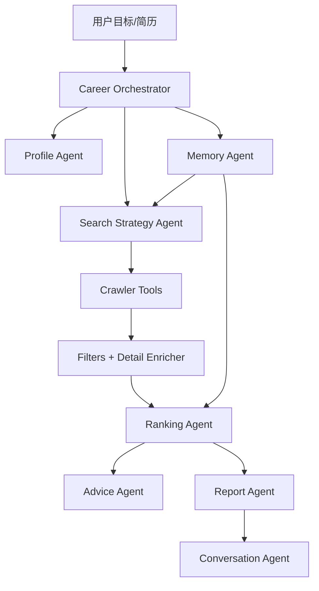

# CareerPilot Agent 产品设计文档

> 版本：v0.3
> 日期：2026-06-03
> 状态：与当前代码实现对齐。Agent MVP、自然语言求职任务、工作区式界面和 BOSS 受控沟通已落地，后续围绕更强多轮 Agent、面试工作台和可选部署迭代。

## 1. 产品定位

CareerPilot Agent 是一个面向中文招聘市场的个人求职智能体。它的核心不是“帮用户多抓一些岗位”，而是把求职过程中重复的搜索、筛选、判断、解释、复盘和行动建议整理成一个可持续协作的 Agent 流程。

一句话定位：

> 上传简历，说出目标，CareerPilot Agent 自动规划搜索、采集岗位、筛选机会、解释匹配、给出简历优化和面试建议，并保存可复盘的本地求职记忆。

当前新增定位：

> 用户也可以把“找什么岗位、怎么筛选、匹配到什么程度、BOSS 打招呼怎么说”写成自然语言任务。系统先解析成可编辑配置，再由用户确认搜索或发送沟通文本。

默认场景：

- 城市：上海
- 岗位类型：社招/全职
- 方向：AI Agent、RAG、大模型应用、LLM 工程、AI 应用开发
- 默认平台：BOSS直聘、智联招聘、前程无忧
- 大模型：DeepSeek，OpenAI SDK 兼容调用方式
- 安全策略：默认不打开交互式浏览器，不自动打开 Boss 登录页；如果目标里明确写“允许 Boss 登录浏览器”，Agent 会尝试这条路径，遇到需要人工处理的页面会停止等待用户。

## 2. 与原项目的质变差异

| 维度 | 原项目/传统岗位工具 | CareerPilot Agent |
| --- | --- | --- |
| 交互方式 | 用户手动配置关键词、平台、页数 | 用户输入目标，Agent 生成搜索计划 |
| 搜索策略 | 单关键词或固定筛选 | 扩展关键词、平台选择、岗位类型和风险提示 |
| 结果展示 | 岗位表格 | 表格 + 卡片 + 推荐等级 + 原因解释 |
| 简历匹配 | 关键词和分数 | 简历画像、项目相关性、缺口、风险、行动建议 |
| 任务配置 | 每次重新填条件 | 自然语言解析为本地任务，可保存、加载和调整 |
| 沟通动作 | 用户自行复制话术 | 生成草稿，用户确认后单岗位执行 |
| 数据质量 | 只展示结果 | 展示平台抓取量、筛选量、字段完整度和失败原因 |
| 记忆能力 | 一次性搜索 | 搜索历史、反馈、投递状态、运行报告和 run_id |
| 安全策略 | 容易误触浏览器登录 | 默认安全模式，登录类动作必须显式授权 |

## 3. 当前已落地功能

### 3.1 Agent 目标搜索

用户可以输入自然语言目标：

```text
帮我找上海 AI Agent 岗位，我是去年毕业的，薪资 20K 以内，社招和校招都可以，双休优先，不要实习。
```

系统会生成结构化 SearchPlan：

- 城市
- 主关键词
- 扩展关键词
- 平台
- 岗位类型
- 薪资范围
- 自然语言里的“20K 以内”会优先作为偏好而不是硬筛选
- 经验要求
- 学历要求
- 双休偏好
- 排除词
- 安全开关
- 数据风险提示

搜索计划要区分硬筛选和偏好：`不要实习`、明确经验上限、明确“只看双休”等条件可以过滤；`双休优先` 与根据毕业时间推断的经验偏好只影响排序、风险和报告，不能在展示前直接把候选清空。

已实现文件：

- `agents/search_strategy_agent.py`
- `agents/career_orchestrator.py`

### 3.2 自然语言求职任务

用户可以输入更完整的任务描述：

```text
ai应用 rag 大模型应用，上海北京深圳杭州，本科，8到20K，只投活跃 HR，100 字以内介绍 RAG 项目，不提薪资，语气礼貌
```

系统会先解析为可编辑任务草稿，字段包括：

- 搜索职位和城市。
- 平台和求职类型。
- AI 筛选职位说明。
- 包含/排除关键词或正则。
- 简历匹配阈值。
- 打招呼字数上限。
- 打招呼提示词边界。
- 回复提示词边界。
- 发送限制。

行为边界：

- 解析结果必须先展示为表单，不直接执行。
- 任务保存为本地 JSON，不迁移 SQLite。
- 按任务检索完成后进入“岗位结果”工作区。
- 沟通文本生成可以参考用户写的自然语言约束，但不能覆盖系统边界。

已实现文件：

- `agents/search_strategy_agent.py`
- `memory/store.py`
- `app.py`

### 3.3 多平台岗位采集

当前已接入：

- BOSS直聘
- 智联招聘
- 前程无忧
- 猎聘
- 拉勾
- 牛客网
- 应届生
- 国聘网
- 丁香人才网
- 就业在线

产品策略：

- 默认展示平台为 BOSS直聘、智联招聘、前程无忧。
- 默认不包含需要交互登录的 Boss 浏览器方案。
- 平台越多时，原始岗位可能更多，但最终展示会经过去重、岗位类型、薪资、学历、明确经验上限、明确双休硬筛、排除词和推荐排序，因此最终数量不一定单调增加。
- 搜索结果必须解释每个平台的抓取量、筛选量和最终展示量。

### 3.4 简历画像与岗位推荐

当前已实现：

- 支持 PDF、DOCX、TXT 简历文本提取。
- 生成本地简历画像。
- 根据画像和岗位字段计算推荐分。
- 输出推荐等级：王牌机会、强烈推荐、优先关注、可以投递、备选岗位、普通岗位。
- 输出匹配原因、缺口、风险、简历动作和面试重点。
- DeepSeek 不可用时回退到本地规则建议。

已实现文件：

- `agents/profile_agent.py`
- `agents/ranking_agent.py`
- `agents/advice_agent.py`
- `agents/resume_matcher.py`

### 3.5 运行记录、报告和问答

每次 Agent 搜索都会生成：

- `run_id`
- 执行步骤
- 搜索计划
- 平台质量摘要
- 推荐分布
- Top 岗位摘要
- Markdown 报告
- 可追问的上下文

用户可以问：

- 为什么结果这么少？
- 哪个平台贡献最多？
- 优先投哪个岗位？
- 双休为什么获取不到？
- 下一步怎么做？

已实现文件：

- `agents/report_agent.py`
- `agents/conversation_agent.py`
- `memory/store.py`

### 3.6 Streamlit 操作台

当前前端已包含：

- 任务配置工作区：简历上传、自然语言任务、快速 Agent 检索、手动搜索。
- 岗位结果工作区：岗位统计、搜索质量、表格视图、卡片视图。
- 沟通行动工作区：选择目标岗位、查看匹配结论、生成 BOSS 沟通草稿、生成简历优化和面试材料。
- 记录记忆工作区：Agent 解释、Agent 问答、最近运行记录和求职记忆导出。

已实现文件：

- `app.py`

### 3.7 BOSS 受控沟通

当前 BOSS 沟通只做受控执行层：

- 根据岗位、简历画像、匹配结论和用户自定义提示词生成打招呼草稿。
- 支持 20-300 字上限设置，默认 100 字。
- 支持用户粘贴 HR 消息后生成回复建议。
- 有 `chat_url` 的 BOSS 岗位支持干跑检查和确认发送。
- 无 `chat_url` 或非 BOSS 岗位只生成文本。
- 每次只处理单个岗位。
- 发送前必须展示完整文本，并以用户编辑框最终内容为准。
- 页面需要人工处理时记录状态，不继续执行发送。

已实现文件：

- `agents/outreach_agent.py`
- `crawlers/boss_outreach.py`
- `memory/store.py`
- `app.py`

### 3.8 CLI

当前命令：

```powershell
python cli.py agent-search "帮我找上海 AI Agent 岗位，我是去年毕业的，薪资 20K 以内，社招和校招都可以，双休优先，不要实习。"
python cli.py agent-runs --limit 5
python cli.py agent-ask "为什么结果这么少"
python cli.py llm-status --test
python cli.py crawl -k "AI Agent" -l "上海" -p boss -p zhilian -p 51job --pages 2 --job-type 社招
python cli.py match-resume .\resume.pdf --ai-top 0
python cli.py advise-resume .\resume.pdf --job-id <job_id>
```

已实现文件：

- `cli.py`

## 4. 核心用户流程

1. 用户上传简历，或先跳过简历直接搜索。
2. 用户输入一句话目标。
3. Agent 生成搜索计划并解释风险。
4. Agent 调用多平台采集。
5. 系统展示平台抓取量、筛选量和字段完整度。
6. Ranking Agent 输出推荐等级和排序。
7. 用户在表格或卡片中查看岗位。
8. 用户选择岗位，生成简历优化、面试建议或 BOSS 沟通草稿。
9. 用户编辑并确认后，才执行单岗位 BOSS 沟通。
10. 用户标记反馈或投递状态。
11. 下次搜索时读取本地记忆，辅助调整策略。

## 5. Agent 设计



### 5.1 Career Orchestrator

职责：

- 创建 Agent 任务和 `run_id`。
- 调用简历画像、记忆、搜索策略、爬虫、排序和报告模块。
- 记录执行步骤。
- 在异常时保存失败状态。

### 5.2 Search Strategy Agent

职责：

- 把自然语言目标转为 SearchPlan。
- 默认城市上海。
- 默认岗位类型社招。
- 默认平台为 BOSS直聘、智联招聘、前程无忧。
- 默认不打开浏览器。
- 识别“不要实习”“不要校招”“不要外包”等排除条件。
- 把“双休优先”和毕业时间推断出的经验偏好交给 Ranking Agent，不把软偏好当成硬过滤。
- 扩展支持自然语言求职任务，把职位、城市、薪资、学历、活跃 HR、匹配阈值、沟通字数和提示词边界解析为任务配置。

### 5.2.1 Outreach Agent

职责：

- 基于岗位、简历画像、匹配结论和任务提示词生成 BOSS 打招呼草稿。
- 基于 HR 消息生成回复建议。
- 控制字数上限，默认 100 字，允许 20-300 字。
- 不编造简历经历，不伪造项目成果。
- LLM 不可用时提供本地 fallback。

### 5.3 Profile Agent

职责：

- 从简历文本提取技能、项目、经历、学历和目标方向。
- 保存本地画像。
- 对不确定内容保持保守，不编造经历。

### 5.4 Ranking Agent

职责：

- 对岗位进行本地评分。
- 输出推荐等级。
- 解释匹配原因、缺口和风险。
- 缺字段时标记未知，不直接当作负面事实。

### 5.5 Advice Agent

职责：

- 针对单岗位生成简历优化建议。
- 生成面试准备建议。
- 生成投递前行动清单。
- 只基于简历已有事实和岗位要求给建议。

### 5.6 Memory Agent

职责：

- 汇总用户画像。
- 汇总岗位反馈。
- 汇总投递状态。
- 为下一次搜索提供上下文。

### 5.7 Report Agent

职责：

- 生成 Markdown 搜索报告。
- 汇总搜索计划、平台质量、推荐分布、Top 岗位和下一步。

### 5.8 Conversation Agent

职责：

- 基于最近一次或指定 `run_id` 回答用户问题。
- 重点解释结果数量、平台差异、字段缺失、优先投递和下一步。

## 6. 数据模型

### 6.1 SearchPlan

```json
{
  "goal_text": "",
  "keyword": "AI Agent",
  "expanded_keywords": ["AI Agent", "智能体", "大模型应用", "RAG", "LLM", "AI应用开发"],
  "location": "上海",
  "platforms": ["boss", "zhilian", "51job"],
  "job_types": ["社招", "校招"],
  "max_pages": 2,
  "criteria": {
    "salary_preferred_max_k": 20,
    "experience_preferred_max_years": 1,
    "degrees": ["不限", "大专", "本科", "硕士", "博士"],
    "weekend_preferred": true,
    "weekend_only": false
  },
  "excluded_terms": ["实习"],
  "safety": {
    "use_browser_crawlers": false,
    "allow_browser_login": false
  }
}
```

### 6.2 UserProfile

```json
{
  "name": "",
  "target_roles": [],
  "skills": [],
  "projects": [],
  "experience_years": null,
  "education": [],
  "strengths": [],
  "gaps": [],
  "updated_at": ""
}
```

### 6.3 JobDecision

```json
{
  "job_id": "",
  "platform": "",
  "score": 82,
  "level": "强推",
  "matched_reasons": [],
  "missing_requirements": [],
  "risks": [],
  "resume_actions": [],
  "interview_focus": []
}
```

### 6.4 AgentRun

```json
{
  "run_id": "",
  "status": "completed",
  "goal_text": "",
  "steps": [],
  "plan": {},
  "summary": {},
  "recommendation_counts": {},
  "top_jobs": [],
  "report_path": "",
  "created_at": "",
  "updated_at": ""
}
```

### 6.5 OutreachTask

```json
{
  "task_id": "",
  "name": "RAG 应用求职任务",
  "search_text": "大模型应用",
  "cities": ["上海", "北京", "深圳", "杭州"],
  "platforms": ["boss", "zhilian", "51job"],
  "job_types": ["社招"],
  "criteria": {
    "min_salary_k": 8,
    "max_salary_k": 20,
    "degrees": ["本科"]
  },
  "regex_include": "rag|大模型|ai应用",
  "regex_exclude": "外包|销售",
  "match_threshold": 70,
  "greeting_max_chars": 100,
  "greeting_prompt": "突出 RAG 项目，不提薪资，语气礼貌",
  "reply_prompt": "简洁回复，先确认岗位信息",
  "only_active_hr": true
}
```

## 7. 前端设计

### 7.1 当前状态

当前 Streamlit 已拆成 4 个工作区：

- 任务配置：自然语言任务、简历上传、快速 Agent 检索、手动搜索。
- 岗位结果：当前结果、数据库岗位、搜索摘要、表格/卡片视图。
- 沟通行动：目标岗位选择、匹配结论、岗位详情、BOSS 沟通草稿、简历优化和面试准备。
- 记录记忆：Agent 解释、问答、运行记录、求职记忆导出。

### 7.2 界面拆分原则

- 首屏只保留当前阶段最常用控件。
- 已保存任务、手动搜索、搜索质量、详情和历史记录默认放入折叠区。
- 搜索和任务配置在“任务配置”里完成，结果查看在“岗位结果”里完成，岗位后续动作在“沟通行动”里完成。
- 避免把简历、搜索、结果、沟通、记忆同时铺满一个页面。

### 7.3 必须处理的界面状态

- 未上传简历：允许先搜索，但提示上传后能精准匹配。
- 已上传简历但未搜索：提示输入目标。
- 搜索中：展示 Agent 当前步骤。
- 搜索完成：展示岗位、摘要、字段完整度、报告下载。
- 条件变化但未重新搜索：提示当前结果来自上一次搜索。
- 无结果：解释是平台无数据、筛选太严，还是字段不可得。
- 需要登录：只提示，不自动打开。

## 8. 安全与合规原则

### 8.1 API Key

- 真实 Key 只放 `config.local.yaml` 或环境变量。
- `config.local.yaml` 不提交 GitHub。
- 文档不展示真实 Key。

### 8.2 招聘平台采集

- 默认不代替用户完成登录和页面确认。
- 默认不自动打开交互式浏览器。
- 对需要登录才能获取的字段明确标注。
- 对采集失败返回状态，不假装字段不存在。

### 8.3 简历和建议

- 不编造经历。
- 不伪造学历、公司、项目、成果。
- 建议使用“优化方向”和“可补充关键词”，而不是生成虚假履历。

### 8.4 自动投递

MVP 不做自动批量投递、自动上传简历，也不做自动代聊 HR。当前 BOSS 沟通只允许用户确认后的单岗位发送。后续如果做更强投递能力，必须：

- 用户逐条确认。
- 有频率限制。
- 有黑名单和撤销机制。
- 不自动骚扰 HR。

## 9. 技术架构

当前主要模块：

```text
app.py
cli.py
llm_client.py
job_filters.py
db.py

agents/
  career_orchestrator.py
  search_strategy_agent.py
  profile_agent.py
  ranking_agent.py
  advice_agent.py
  memory_agent.py
  report_agent.py
  conversation_agent.py
  resume_matcher.py

crawlers/
  aggregator.py
  zhilian.py
  job51.py
  liepin.py
  nowcoder.py
  detail_enricher.py
  boss*.py

memory/
  store.py
```

LLM 配置：

- 默认 provider：`deepseek`
- 默认 model：`deepseek-v4-flash`
- 默认 base_url：`https://api.deepseek.com`
- OpenAI SDK 兼容调用方式
- DeepSeek 调用失败时，本地建议逻辑继续可用

## 10. 路线图

| 阶段 | 目标 | 状态 |
| --- | --- | --- |
| Phase 1 | Agent 骨架：目标解析 + Orchestrator | 已完成 |
| Phase 2 | 简历画像与匹配升级 | 已完成 |
| Phase 3 | 岗位决策 Agent | 已完成 |
| Phase 4 | 单岗位行动建议 | 已完成 |
| Phase 5 | 本地求职记忆 | 已完成 |
| Phase 5.5 | 报告、运行记录和 Agent 问答 | 已完成 |
| Phase 6 | Streamlit 初版操作台 | 已完成 |
| Phase 7 | 项目独立化、文档和 GitHub 发布打磨 | 进行中 |
| Phase 8 | 自然语言任务和工作区式界面 | 已完成 |
| Phase 9 | BOSS 受控沟通草稿与确认发送 | 已完成 |
| Phase 10 | 面试准备工作台 | 待做 |
| Phase 11 | 更强多轮 Agent Loop | 待做 |
| Phase 12 | 可选部署、定时任务和 MCP 完善 | 待做 |

## 11. MVP 成功指标

- 用户从一句话目标到看到推荐岗位，少于 3 分钟。
- 默认不会弹出登录浏览器。
- 默认结果以社招/全职为主，不被实习和校招污染。
- 搜索摘要能解释“为什么结果少”和“为什么平台多但最终少”。
- 每个推荐岗位都有推荐等级、理由、风险和下一步建议。
- 用户能完成至少一个岗位的简历优化、面试准备或 BOSS 沟通草稿生成。
- 用户能保存一个自然语言求职任务，并在重启后加载继续使用。
- 每次 Agent 搜索都能生成可下载、可复盘的报告。

## 12. 风险与应对

| 风险 | 表现 | 应对 |
| --- | --- | --- |
| 平台反爬 | 结果少、字段缺失 | 展示采集状态和字段完整度 |
| 登录限制 | Boss 或详情页拿不到 | 默认不登录，显式授权才尝试 |
| 字段缺失 | 双休、地址、经验为空 | 标记未知，不编造 |
| 平台越多结果不增 | 去重和筛选后最终变少 | 展示原始抓取、筛选和最终数量 |
| 软偏好误伤结果 | 双休优先或毕业时间把候选清空 | 偏好进入排序和风险提示，明确硬条件才过滤 |
| LLM 不稳定 | DeepSeek 请求失败 | 回退本地规则建议 |
| 简历建议编造 | 模型扩写过度 | 零编造原则，只基于简历事实 |
| 沟通动作误触 | 文本未经用户确认就发送 | 草稿、编辑、确认三步分离，只处理单岗位 |

## 13. 下一步优先级

1. 清理剩余旧 Demo 和旧文档口径。
2. 增加截图、示例数据和演示脚本。
3. 给自然语言任务、Outreach 草稿和记录写入补基础测试。
4. 为核心 Agent 模块补基础测试。
5. 开始面试准备工作台。

当前不优先做自动批量投递。先把“自然语言任务 + 精准匹配 + 受控沟通 + 求职记忆”打磨成稳定的新项目核心。
