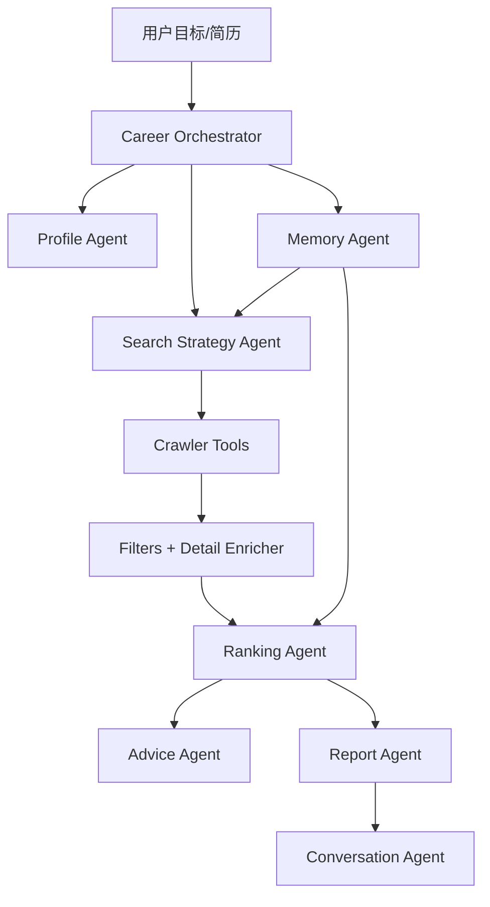

# CareerPilot Agent 产品设计文档

> 版本：v0.2
> 日期：2026-05-20
> 状态：与当前代码实现对齐。Agent MVP 已落地，后续围绕界面产品化、面试工作台和更强多轮 Agent 能力迭代。

## 1. 产品定位

CareerPilot Agent 是一个面向中文招聘市场的个人求职智能体。它的核心不是“帮用户多抓一些岗位”，而是把求职过程中重复的搜索、筛选、判断、解释、复盘和行动建议整理成一个可持续协作的 Agent 流程。

一句话定位：

> 上传简历，说出目标，CareerPilot Agent 自动规划搜索、采集岗位、筛选机会、解释匹配、给出简历优化和面试建议，并保存可复盘的本地求职记忆。

默认场景：

- 城市：上海
- 岗位类型：社招/全职
- 方向：AI Agent、RAG、大模型应用、LLM 工程、AI 应用开发
- 平台：智联、51job、猎聘、牛客
- 大模型：DeepSeek，OpenAI SDK 兼容调用方式
- 安全策略：默认不打开交互式浏览器，不自动打开 Boss 登录页，不绕过登录、验证码或滑块

## 2. 与原项目的质变差异

| 维度 | 原项目/传统岗位工具 | CareerPilot Agent |
| --- | --- | --- |
| 交互方式 | 用户手动配置关键词、平台、页数 | 用户输入目标，Agent 生成搜索计划 |
| 搜索策略 | 单关键词或固定筛选 | 扩展关键词、平台选择、岗位类型和风险提示 |
| 结果展示 | 岗位表格 | 表格 + 卡片 + 推荐等级 + 原因解释 |
| 简历匹配 | 关键词和分数 | 简历画像、项目相关性、缺口、风险、行动建议 |
| 数据质量 | 只展示结果 | 展示平台抓取量、筛选量、字段完整度和失败原因 |
| 记忆能力 | 一次性搜索 | 搜索历史、反馈、投递状态、运行报告和 run_id |
| 安全策略 | 容易误触浏览器登录 | 默认安全模式，登录类动作必须显式授权 |

## 3. 当前已落地功能

### 3.1 Agent 目标搜索

用户可以输入自然语言目标：

```text
帮我找上海 AI Agent 社招，薪资 20K 以上，3 年以内，双休优先，不要实习不要校招。
```

系统会生成结构化 SearchPlan：

- 城市
- 主关键词
- 扩展关键词
- 平台
- 岗位类型
- 薪资范围
- 经验要求
- 学历要求
- 双休偏好
- 排除词
- 安全开关
- 数据风险提示

已实现文件：

- `agents/search_strategy_agent.py`
- `agents/career_orchestrator.py`

### 3.2 多平台岗位采集

当前已接入：

- 智联招聘
- 51job/前程无忧
- 猎聘
- 牛客
- Boss 非交互/显式授权/兜底方案

产品策略：

- 默认平台不包含需要交互登录的 Boss 浏览器方案。
- 平台越多时，原始岗位可能更多，但最终展示会经过去重、岗位类型、薪资、经验、学历、双休、排除词和推荐排序，因此最终数量不一定单调增加。
- 搜索结果必须解释每个平台的抓取量、筛选量和最终展示量。

### 3.3 简历画像与岗位推荐

当前已实现：

- 支持 PDF、DOCX、TXT 简历文本提取。
- 生成本地简历画像。
- 根据画像和岗位字段计算推荐分。
- 输出推荐等级：强推、可投、谨慎、不建议。
- 输出匹配原因、缺口、风险、简历动作和面试重点。
- DeepSeek 不可用时回退到本地规则建议。

已实现文件：

- `agents/profile_agent.py`
- `agents/ranking_agent.py`
- `agents/advice_agent.py`
- `agents/resume_matcher.py`

### 3.4 运行记录、报告和问答

每次 Agent 搜索都会生成：

- `run_id`
- 执行步骤
- 搜索计划
- 平台质量摘要
- 推荐分布
- Top 岗位摘要
- Markdown 报告
- 可追问的上下文

用户可以问：

- 为什么结果这么少？
- 哪个平台贡献最多？
- 优先投哪个岗位？
- 双休为什么获取不到？
- 下一步怎么做？

已实现文件：

- `agents/report_agent.py`
- `agents/conversation_agent.py`
- `memory/store.py`

### 3.5 Streamlit 操作台

当前前端已包含：

- Agent 求职目标输入
- 简历上传
- 搜索计划展示
- Agent 执行步骤
- 求职记忆摘要
- 岗位表格视图
- 岗位卡片视图
- Agent 搜索报告下载
- 最近 Agent 任务
- Agent 问答
- 单岗位简历优化与面试建议

已实现文件：

- `app.py`

### 3.6 CLI

当前命令：

```powershell
python cli.py agent-search "帮我找上海 AI Agent 社招，薪资 20K 以上，3 年以内，双休优先，不要实习不要校招。"
python cli.py agent-runs --limit 5
python cli.py agent-ask "为什么结果这么少"
python cli.py llm-status --test
python cli.py crawl -k "AI Agent" -l "上海" -p zhilian -p 51job -p liepin --pages 2 --job-type 社招
python cli.py match-resume .\resume.pdf --ai-top 0
python cli.py advise-resume .\resume.pdf --job-id <job_id>
```

已实现文件：

- `cli.py`

## 4. 核心用户流程

1. 用户上传简历，或先跳过简历直接搜索。
2. 用户输入一句话目标。
3. Agent 生成搜索计划并解释风险。
4. Agent 调用多平台采集。
5. 系统展示平台抓取量、筛选量和字段完整度。
6. Ranking Agent 输出推荐等级和排序。
7. 用户在表格或卡片中查看岗位。
8. 用户选择岗位，生成简历优化和面试建议。
9. 用户标记反馈或投递状态。
10. 下次搜索时读取本地记忆，辅助调整策略。

## 5. Agent 设计



### 5.1 Career Orchestrator

职责：

- 创建 Agent 任务和 `run_id`。
- 调用简历画像、记忆、搜索策略、爬虫、排序和报告模块。
- 记录执行步骤。
- 在异常时保存失败状态。

### 5.2 Search Strategy Agent

职责：

- 把自然语言目标转为 SearchPlan。
- 默认城市上海。
- 默认岗位类型社招。
- 默认平台为智联、51job、猎聘、牛客。
- 默认不打开浏览器。
- 识别“不要实习”“不要校招”“不要外包”等排除条件。

### 5.3 Profile Agent

职责：

- 从简历文本提取技能、项目、经历、学历和目标方向。
- 保存本地画像。
- 对不确定内容保持保守，不编造经历。

### 5.4 Ranking Agent

职责：

- 对岗位进行本地评分。
- 输出推荐等级。
- 解释匹配原因、缺口和风险。
- 缺字段时标记未知，不直接当作负面事实。

### 5.5 Advice Agent

职责：

- 针对单岗位生成简历优化建议。
- 生成面试准备建议。
- 生成投递前行动清单。
- 只基于简历已有事实和岗位要求给建议。

### 5.6 Memory Agent

职责：

- 汇总用户画像。
- 汇总岗位反馈。
- 汇总投递状态。
- 为下一次搜索提供上下文。

### 5.7 Report Agent

职责：

- 生成 Markdown 搜索报告。
- 汇总搜索计划、平台质量、推荐分布、Top 岗位和下一步。

### 5.8 Conversation Agent

职责：

- 基于最近一次或指定 `run_id` 回答用户问题。
- 重点解释结果数量、平台差异、字段缺失、优先投递和下一步。

## 6. 数据模型

### 6.1 SearchPlan

```json
{
  "goal_text": "",
  "keyword": "AI Agent",
  "expanded_keywords": ["AI Agent", "大模型应用", "RAG", "LLM", "AI应用开发"],
  "location": "上海",
  "platforms": ["zhilian", "51job", "liepin", "nowcoder"],
  "job_types": ["社招"],
  "max_pages": 2,
  "criteria": {
    "min_salary_k": 20,
    "max_experience_years": 3,
    "degrees": ["不限", "大专", "本科", "硕士"],
    "weekend_preference": true,
    "excluded_terms": ["实习", "校招", "外包"]
  },
  "safety": {
    "use_browser_crawlers": false,
    "allow_browser_login": false
  }
}
```

### 6.2 UserProfile

```json
{
  "name": "",
  "target_roles": [],
  "skills": [],
  "projects": [],
  "experience_years": null,
  "education": [],
  "strengths": [],
  "gaps": [],
  "updated_at": ""
}
```

### 6.3 JobDecision

```json
{
  "job_id": "",
  "platform": "",
  "score": 82,
  "level": "强推",
  "matched_reasons": [],
  "missing_requirements": [],
  "risks": [],
  "resume_actions": [],
  "interview_focus": []
}
```

### 6.4 AgentRun

```json
{
  "run_id": "",
  "status": "completed",
  "goal_text": "",
  "steps": [],
  "plan": {},
  "summary": {},
  "recommendation_counts": {},
  "top_jobs": [],
  "report_path": "",
  "created_at": "",
  "updated_at": ""
}
```

## 7. 前端设计

### 7.1 当前状态

当前 Streamlit 已能完成基本 Agent 操作台能力：

- 输入目标
- 上传简历
- 搜索岗位
- 查看计划和执行步骤
- 查看表格或卡片结果
- 下载报告
- 查看最近任务
- 向 Agent 提问
- 生成单岗位建议

### 7.2 下一步目标界面

后续界面应演进为三栏结构：

```text
┌─────────────────────────────────────────────────────────────┐
│ Header: CareerPilot Agent / DeepSeek 状态 / 当前画像          │
├───────────────┬─────────────────────────────┬───────────────┤
│ 左侧控制区     │ 中间岗位区                   │ 右侧 Agent 区  │
│ 简历上传       │ 搜索摘要                     │ 对话解释        │
│ 目标输入       │ 推荐岗位                     │ 行动建议        │
│ 筛选条件       │ 表格/卡片切换                │ 面试建议        │
│ 安全开关       │ 字段完整度                   │ 报告/记忆        │
└───────────────┴─────────────────────────────┴───────────────┘
```

### 7.3 必须处理的界面状态

- 未上传简历：允许先搜索，但提示上传后能精准匹配。
- 已上传简历但未搜索：提示输入目标。
- 搜索中：展示 Agent 当前步骤。
- 搜索完成：展示岗位、摘要、字段完整度、报告下载。
- 条件变化但未重新搜索：提示当前结果来自上一次搜索。
- 无结果：解释是平台无数据、筛选太严，还是字段不可得。
- 需要登录：只提示，不自动打开。

## 8. 安全与合规原则

### 8.1 API Key

- 真实 Key 只放 `config.local.yaml` 或环境变量。
- `config.local.yaml` 不提交 GitHub。
- 文档不展示真实 Key。

### 8.2 招聘平台采集

- 默认不绕过登录、验证码、滑块。
- 默认不自动打开交互式浏览器。
- 对需要登录才能获取的字段明确标注。
- 对采集失败返回状态，不假装字段不存在。

### 8.3 简历和建议

- 不编造经历。
- 不伪造学历、公司、项目、成果。
- 建议使用“优化方向”和“可补充关键词”，而不是生成虚假履历。

### 8.4 自动投递

MVP 不做自动批量投递，也不做自动代聊 HR。后续如果做，必须：

- 用户逐条确认。
- 有频率限制。
- 有黑名单和撤销机制。
- 不自动骚扰 HR。

## 9. 技术架构

当前主要模块：

```text
app.py
cli.py
llm_client.py
job_filters.py
db.py

agents/
  career_orchestrator.py
  search_strategy_agent.py
  profile_agent.py
  ranking_agent.py
  advice_agent.py
  memory_agent.py
  report_agent.py
  conversation_agent.py
  resume_matcher.py

crawlers/
  aggregator.py
  zhilian.py
  job51.py
  liepin.py
  nowcoder.py
  detail_enricher.py
  boss*.py

memory/
  store.py
```

LLM 配置：

- 默认 provider：`deepseek`
- 默认 model：`deepseek-v4-flash`
- 默认 base_url：`https://api.deepseek.com`
- OpenAI SDK 兼容调用方式
- DeepSeek 调用失败时，本地建议逻辑继续可用

## 10. 路线图

| 阶段 | 目标 | 状态 |
| --- | --- | --- |
| Phase 1 | Agent 骨架：目标解析 + Orchestrator | 已完成 |
| Phase 2 | 简历画像与匹配升级 | 已完成 |
| Phase 3 | 岗位决策 Agent | 已完成 |
| Phase 4 | 单岗位行动建议 | 已完成 |
| Phase 5 | 本地求职记忆 | 已完成 |
| Phase 5.5 | 报告、运行记录和 Agent 问答 | 已完成 |
| Phase 6 | Streamlit 初版操作台 | 已完成 |
| Phase 7 | 项目独立化、文档和 GitHub 发布打磨 | 进行中 |
| Phase 8 | 三栏式产品化界面 | 待做 |
| Phase 9 | 面试准备工作台 | 待做 |
| Phase 10 | 更强多轮 Agent Loop | 待做 |
| Phase 11 | 可选部署、定时任务和 MCP 完善 | 待做 |

## 11. MVP 成功指标

- 用户从一句话目标到看到推荐岗位，少于 3 分钟。
- 默认不会弹出登录浏览器。
- 默认结果以社招/全职为主，不被实习和校招污染。
- 搜索摘要能解释“为什么结果少”和“为什么平台多但最终少”。
- 每个推荐岗位都有推荐等级、理由、风险和下一步建议。
- 用户能完成至少一个岗位的简历优化和面试准备。
- 每次 Agent 搜索都能生成可下载、可复盘的报告。

## 12. 风险与应对

| 风险 | 表现 | 应对 |
| --- | --- | --- |
| 平台反爬 | 结果少、字段缺失 | 展示采集状态和字段完整度 |
| 登录限制 | Boss 或详情页拿不到 | 默认不登录，显式授权才尝试 |
| 字段缺失 | 双休、地址、经验为空 | 标记未知，不编造 |
| 平台越多结果不增 | 去重和筛选后最终变少 | 展示原始抓取、筛选和最终数量 |
| LLM 不稳定 | DeepSeek 请求失败 | 回退本地规则建议 |
| 简历建议编造 | 模型扩写过度 | 零编造原则，只基于简历事实 |

## 13. 下一步优先级

1. 清理剩余旧 Demo 和旧文档口径。
2. 完善三栏式 Streamlit 体验。
3. 增加截图、示例数据和演示脚本。
4. 为核心 Agent 模块补基础测试。
5. 开始面试准备工作台。

当前不优先做自动投递。先把“目标驱动搜索 + 精准匹配 + 行动建议 + 求职记忆”打磨成稳定的新项目核心。
