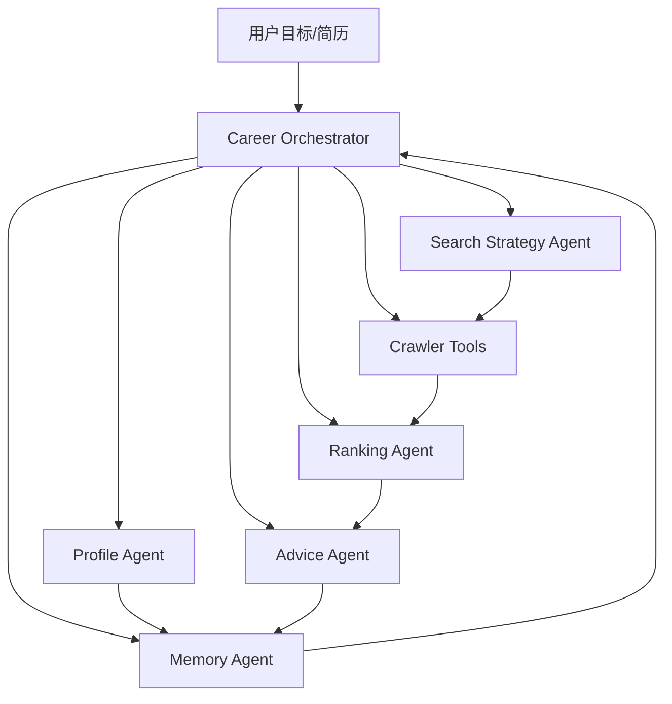

# CareerPilot Agent 产品设计文档

> 版本：v0.1
> 日期：2026-05-18
> 状态：产品设计稿，后续开发以本文档为主线逐步落地

## 1. 产品定位

CareerPilot Agent 是一个面向中文招聘市场的个人求职智能体。它不只是岗位爬取工具，而是一个能理解用户简历、主动制定岗位搜索策略、解释岗位匹配原因、生成简历优化建议、准备面试材料并持续记录求职进度的 AI Agent 操作台。

原项目的核心价值是“抓岗位、做匹配、生成材料”。新项目的核心价值要升级为“让 Agent 代替用户完成求职决策流程中的重复思考和整理工作”。

一句话定位：

> 上传简历，说出目标，CareerPilot Agent 自动规划搜索、采集岗位、筛选机会、解释匹配、给出行动建议，并形成可持续迭代的个人求职记忆。

## 2. 与原项目的质变差异

原项目更像一个多功能工具箱：用户配置关键词、平台、页数，然后系统返回岗位列表和一些建议。

新项目要变成一个 Agent 系统：用户给目标，Agent 负责规划、执行、评估、解释和记忆。

| 维度 | 原项目 | CareerPilot Agent |
| --- | --- | --- |
| 交互方式 | 表单驱动 | 对话 + 任务驱动 |
| 搜索方式 | 用户输入关键词 | Agent 生成搜索策略和关键词组合 |
| 岗位结果 | 表格展示 | Agent 解释每个岗位是否值得投 |
| 简历匹配 | 本地评分 + LLM 建议 | 基于用户画像、偏好、历史反馈的动态评估 |
| 面试准备 | 针对单岗位生成材料 | 根据目标岗位族生成学习路径、题库、追问训练 |
| 数据记忆 | SQLite 岗位库 | 用户画像、偏好、投递状态、反馈记忆 |
| 产品体验 | 爬虫工具 | 求职智能体操作台 |

## 3. 目标用户

### 3.1 核心用户

正在找工作的中文互联网/AI/软件开发求职者，尤其是：

- 希望找 AI Agent、大模型应用、RAG、LLM 工程、后端、前端等技术岗位的人。
- 不想在 Boss、智联、51job、猎聘、牛客之间来回手动筛选的人。
- 有简历但不知道该投哪些岗位、该怎么改简历的人。
- 想把求职流程做成可追踪系统，而不是散落在浏览器收藏夹和 Excel 里的人。

### 3.2 早期默认场景

第一版只聚焦“上传简历后找上海 AI/Agent/大模型相关社招岗位”，原因是：

- 用户已经明确要求默认城市为上海。
- 当前项目已经有多平台采集、筛选、简历匹配基础。
- 聚焦社招能避免牛客等平台大量实习岗位干扰。

后续再扩展到校招、实习、远程、其他城市。

## 4. 产品目标

### 4.1 用户目标

用户最终希望得到的不是“更多岗位”，而是：

- 哪些岗位值得投。
- 为什么适合或不适合。
- 简历应该怎么改。
- 面试要准备什么。
- 下一步该做什么。
- 投递进展是否被记录。

### 4.2 系统目标

CareerPilot Agent 要完成 5 件事：

1. 理解用户：解析简历，形成用户画像。
2. 理解目标：把用户一句话目标转成可执行搜索计划。
3. 找机会：多平台采集岗位，并解释每个平台的数据质量。
4. 做决策：对岗位进行匹配评分、风险判断和推荐排序。
5. 陪执行：生成简历优化、面试建议、打招呼语、投递记录和后续提醒。

## 5. 核心体验

### 5.1 典型用户流程

1. 用户上传简历。
2. 用户输入一句话目标：

   > 帮我找上海 AI Agent 社招，薪资 20K 以上，最好双休，不要外包。

3. Agent 解析目标，生成搜索计划：

   - 城市：上海
   - 岗位类型：社招
   - 关键词：AI Agent、大模型应用、RAG、LLM 工程师、AI 应用开发
   - 平台：智联、51job、猎聘、牛客
   - 排除：实习、校招、外包倾向岗位
   - 风险提示：双休字段通常只有部分平台公开，无法保证完整

4. Agent 执行采集并展示过程：

   - 每个平台抓到多少。
   - 过滤掉多少实习/校招。
   - 哪些字段公开可见。
   - 哪些字段需要登录或详情页验证。

5. Agent 输出推荐岗位：

   - 强推
   - 可投
   - 谨慎
   - 不建议

6. 用户点击一个岗位，Agent 输出：

   - 匹配原因
   - 风险点
   - 简历优化建议
   - 面试问题
   - 投递话术

7. 用户标记状态：

   - 感兴趣
   - 已投递
   - 已沟通
   - 面试中
   - 已拒绝
   - 不合适

8. Agent 下次搜索时根据历史反馈调整策略。

### 5.2 交互形态

前端不再只是“左侧筛选 + 表格”，而是三栏结构：

- 左侧：目标、简历、筛选条件、采集安全开关。
- 中间：岗位卡片/表格、搜索过程摘要、结果质量解释。
- 右侧：Agent 对话区，解释当前结果、回答用户问题、生成行动建议。

## 6. 功能范围

### 6.1 MVP 必做功能

MVP 的目标是先做出“Agent 感”，而不是追求全自动投递。

#### A. 简历画像

输入：PDF、DOCX、TXT 简历。

输出：

- 基本信息
- 技能栈
- 项目经历
- 工作/实习经历
- 教育背景
- 求职方向推断
- 优势关键词
- 可能短板

要求：

- 不编造简历不存在的经历。
- 对不确定内容标记“不确定”。
- 画像存入本地记忆。

#### B. 自然语言目标解析

输入：

> 找上海大模型应用开发，20K 以上，3 年以内经验，双休优先。

输出结构化搜索条件：

- keyword
- expanded_keywords
- location
- job_types
- platforms
- salary_range
- max_experience_years
- degrees
- weekend_preference
- excluded_terms
- search_notes

#### C. 搜索策略 Agent

职责：

- 根据用户目标和简历画像生成关键词组合。
- 判断哪些平台适合搜索。
- 决定是否需要扩展关键词。
- 解释预期风险，例如某些字段必须登录才能拿到。

默认安全策略：

- 不自动打开 Boss 登录浏览器。
- 不自动打开任何交互式浏览器。
- 二次详情抓取默认可配置，但必须显示失败状态。

#### D. 岗位采集与质量摘要

基于现有爬虫实现：

- 智联
- 51job
- 猎聘
- 牛客
- Boss 非交互式方式或手动授权方式

搜索后必须展示：

- selected_platforms
- search_keywords
- 每个平台抓取数
- 每个平台筛选后数量
- 岗位类型分布
- 字段完整度：薪资、经验、学历、双休、公司地址
- 详情抓取状态

#### E. 岗位匹配与推荐

每个岗位输出：

- 总分
- 推荐等级：强推 / 可投 / 谨慎 / 不建议
- 匹配理由
- 缺口
- 风险
- 适合修改简历的方向

评分维度：

| 维度 | 权重 | 说明 |
| --- | --- | --- |
| 技能匹配 | 30% | 简历技能和岗位技能重合度 |
| 项目相关性 | 20% | 项目经历是否能支撑岗位要求 |
| 经验门槛 | 15% | 经验年限是否合理 |
| 学历门槛 | 10% | 学历要求是否满足 |
| 薪资匹配 | 10% | 是否在用户预期范围 |
| 地点/通勤 | 5% | 城市、区域、公司地址 |
| 工作制风险 | 5% | 双休、大小周、单休、不确定 |
| 公司/岗位风险 | 5% | 外包、培训、低可信、信息缺失 |

#### F. 单岗位行动建议

用户选择一个岗位后，Agent 输出：

- 为什么值得投/不值得投。
- 简历应该加强哪 3-5 点。
- 需要补充哪些关键词。
- 面试高频问题。
- 项目追问点。
- 30 秒自我介绍方向。
- 打招呼语。

#### G. 求职记忆

本地记录：

- 用户画像
- 搜索目标
- 用户偏好
- 岗位反馈
- 投递状态
- 被用户标记“不合适”的原因

第一版使用 SQLite + JSON 文件即可。

### 6.2 暂不做功能

MVP 阶段暂不做：

- 自动批量投递。
- 自动代聊 HR。
- 绕过登录/验证码/滑块。
- 云端多用户系统。
- 付费系统。
- 自动打开 Boss 登录浏览器。

这些功能有合规和稳定性风险，必须在核心 Agent 流程跑稳后再评估。

## 7. Agent 设计

### 7.1 总体架构



### 7.2 Career Orchestrator

核心调度 Agent。

职责：

- 接收用户自然语言目标。
- 调用简历画像、搜索策略、采集、评分、建议、记忆模块。
- 生成对用户可读的进度说明。
- 在数据不足时主动解释原因。

输入：

- resume_text
- user_goal
- current_preferences
- search_history

输出：

- search_plan
- ranked_jobs
- agent_summary
- next_actions

### 7.3 Profile Agent

职责：

- 解析简历。
- 提取技能、项目、经历、学历。
- 生成用户画像。
- 识别简历中的可迁移关键词。

输出示例：

```json
{
  "target_roles": ["AI Agent 工程师", "大模型应用开发", "RAG 工程师"],
  "skills": ["Python", "FastAPI", "LangChain", "RAG", "React"],
  "projects": [
    {
      "name": "企业知识库 RAG 系统",
      "keywords": ["向量检索", "混合检索", "重排序", "FastAPI"]
    }
  ],
  "strengths": ["AI 应用工程化", "前后端联调", "项目落地"],
  "gaps": ["大规模训练经验不足", "算法论文经历不足"]
}
```

### 7.4 Search Strategy Agent

职责：

- 把用户目标转为搜索计划。
- 根据画像生成扩展关键词。
- 控制平台选择和安全开关。
- 解释数据风险。

输出示例：

```json
{
  "keyword": "AI Agent",
  "expanded_keywords": ["AI Agent", "大模型应用", "RAG", "LLM", "AI应用开发"],
  "location": "上海",
  "job_types": ["社招"],
  "platforms": ["zhilian", "51job", "liepin", "nowcoder"],
  "max_pages": 2,
  "criteria": {
    "min_salary_k": 20,
    "max_experience_years": 3,
    "degrees": ["不限", "大专", "本科", "硕士"]
  },
  "safety": {
    "use_browser_crawlers": false,
    "allow_browser_login": false
  },
  "notes": [
    "默认不打开 Boss 登录浏览器",
    "双休字段并非所有平台列表页公开",
    "牛客可能返回较多实习岗位，会按社招过滤"
  ]
}
```

### 7.5 Ranking Agent

职责：

- 综合简历画像和岗位字段打分。
- 输出推荐等级。
- 给出可解释原因。

要求：

- 本地规则先评分，LLM 只做解释和精排。
- 缺字段时不能直接判负，要标记“不确定”。
- 对实习、校招、外包、培训类岗位要明确提示。

### 7.6 Advice Agent

职责：

- 对单个岗位生成简历优化建议。
- 生成面试准备建议。
- 生成投递话术。

要求：

- 只基于简历已有事实做优化。
- 不编造项目经历。
- 修改建议要能落到简历条目和关键词。

### 7.7 Memory Agent

职责：

- 保存用户画像。
- 保存偏好。
- 保存岗位反馈。
- 保存投递状态。
- 供下一次搜索调整策略。

第一版记忆结构：

```text
data/memory/
  profile.json
  preferences.json
  search_history.jsonl
  job_feedback.jsonl
```

## 8. 数据模型

### 8.1 UserProfile

```json
{
  "name": "",
  "location": "",
  "target_roles": [],
  "skills": [],
  "projects": [],
  "experience_years": null,
  "education": [],
  "strengths": [],
  "gaps": [],
  "updated_at": ""
}
```

### 8.2 SearchPlan

```json
{
  "goal_text": "",
  "keyword": "",
  "expanded_keywords": [],
  "location": "上海",
  "platforms": [],
  "job_types": ["社招"],
  "max_pages": 1,
  "criteria": {},
  "safety": {
    "use_browser_crawlers": false,
    "allow_browser_login": false
  },
  "created_at": ""
}
```

### 8.3 JobDecision

```json
{
  "job_id": "",
  "platform": "",
  "score": 0,
  "level": "可投",
  "matched_reasons": [],
  "missing_requirements": [],
  "risks": [],
  "resume_actions": [],
  "interview_focus": []
}
```

### 8.4 ApplicationRecord

```json
{
  "job_key": "",
  "status": "interested",
  "notes": "",
  "last_action_at": "",
  "next_action": ""
}
```

## 9. 前端设计

### 9.1 页面结构

```text
┌─────────────────────────────────────────────────────────────┐
│ Header: CareerPilot Agent / LLM状态 / 当前画像                     │
├───────────────┬─────────────────────────────┬───────────────┤
│ 左侧控制区     │ 中间岗位区                   │ 右侧Agent区    │
│ 简历上传       │ 搜索摘要                     │ 对话解释        │
│ 目标输入       │ 推荐岗位                     │ 行动建议        │
│ 筛选条件       │ 表格/卡片切换                │ 面试建议        │
│ 安全开关       │ 字段完整度                   │ 投递话术        │
└───────────────┴─────────────────────────────┴───────────────┘
```

### 9.2 关键界面状态

- 未上传简历：引导上传简历，可先用普通搜索。
- 已上传简历但未搜索：提示输入目标。
- 搜索中：展示 Agent 当前步骤。
- 搜索完成：展示岗位、摘要、字段完整度。
- 条件变化但未刷新：提示当前结果为上一次结果。
- 无结果：解释是平台无数据、筛选太严，还是字段不可得。
- 需要登录：只提示，不自动打开。

### 9.3 岗位卡片字段

每张岗位卡片展示：

- 推荐等级
- 匹配分
- 公司
- 岗位
- 平台
- 地点/公司地址
- 薪资
- 经验
- 学历
- 双休/福利
- 风险标签
- 推荐理由摘要

## 10. 安全与合规原则

### 10.1 API Key

- API Key 不写入代码。
- 使用 `config.local.yaml` 或环境变量。
- 文档中不展示真实 Key。

### 10.2 招聘平台采集

- 默认不绕过登录、验证码、滑块。
- 默认不自动打开交互式浏览器。
- 对需要登录才能获取的字段明确标注。
- 对采集失败返回状态，而不是假装字段不存在。

### 10.3 简历生成

- 不编造经历。
- 不伪造学历、公司、项目、成果。
- 对建议使用“可改写方向”，而不是直接生成虚假履历。

### 10.4 自动投递

MVP 不做自动投递。后续如做，也必须：

- 用户逐条确认。
- 有投递频率限制。
- 有黑名单和撤销机制。
- 不自动骚扰 HR。

## 11. 技术架构

### 11.1 当前基础

已有模块：

- `app.py`：Streamlit 前端。
- `crawlers/`：多平台采集。
- `agents/resume_matcher.py`：简历解析、匹配、建议。
- `job_filters.py`：岗位类型、薪资、经验、学历、双休过滤。
- `db.py`：SQLite 存储。
- `llm_client.py`：DeepSeek/OpenAI 兼容 LLM 调用。

### 11.2 目标结构

```text
agents/
  career_orchestrator.py
  profile_agent.py
  search_strategy_agent.py
  ranking_agent.py
  advice_agent.py
  memory_agent.py

tools/
  job_search_tool.py
  resume_tool.py
  ranking_tool.py

memory/
  store.py

ui/
  components/
  views/
```

第一阶段可以先不大搬目录，优先在现有结构中新增 Agent 文件，等功能稳定后再重构目录。

## 12. 开发路线图

### Phase 1：Agent 骨架

目标：把“表单搜索工具”升级为“目标驱动 Agent”。

任务：

- 新增 `agents/search_strategy_agent.py`。
- 新增 `agents/career_orchestrator.py`。
- 支持一句话目标解析。
- 生成 SearchPlan。
- Orchestrator 调用现有 `collect_all_jobs()`。
- 前端新增“告诉 Agent 你的求职目标”输入框。
- 搜索完成后输出 Agent 总结。

验收标准：

- 用户输入“找上海 AI Agent 社招，20K 以上，双休优先，不要实习”，系统能生成结构化搜索计划。
- 默认不打开浏览器。
- 能返回岗位结果和搜索摘要。
- Agent 能解释为什么结果少。

### Phase 2：简历画像与匹配升级

目标：让 Agent 真的理解用户。

任务：

- 新增 `agents/profile_agent.py`。
- 保存 `data/memory/profile.json`。
- 把简历画像接入岗位评分。
- 岗位推荐理由引用画像中的技能和项目。

验收标准：

- 上传简历后生成结构化画像。
- 岗位卡片能显示“匹配你的哪些技能/项目”。
- 不确定内容不会被当成事实。

### Phase 3：岗位决策 Agent

目标：从“岗位列表”升级为“行动排序”。

任务：

- 新增 `agents/ranking_agent.py`。
- 实现本地评分 + LLM 解释。
- 输出强推/可投/谨慎/不建议。
- 增加风险标签：外包、培训、实习、校招、经验过高、学历过高、双休未知。

验收标准：

- 每个岗位都有推荐等级和解释。
- 缺字段会标记“不确定”，不直接扣死。
- 用户能按推荐等级过滤。

### Phase 4：Advice Agent

目标：对单岗位生成可执行建议。

任务：

- 新增 `agents/advice_agent.py`。
- 生成简历优化建议。
- 生成面试准备建议。
- 生成打招呼语。
- 支持下载 Markdown。

验收标准：

- 对任意岗位可以生成行动建议。
- 建议必须引用岗位要求和简历事实。
- 不编造经历。

### Phase 5：求职记忆

目标：让 Agent 越用越懂用户。

任务：

- 新增 `memory/store.py`。
- 保存用户偏好。
- 保存搜索历史。
- 保存岗位反馈。
- 保存投递状态。
- 下次搜索时读取记忆。

验收标准：

- 用户标记“不合适：外包/薪资低/经验高”后，下次搜索策略会反映这些偏好。
- 应用状态可追踪。

### Phase 6：产品化界面

目标：重做 Streamlit 体验。

任务：

- 三栏布局。
- 岗位卡片视图。
- Agent 对话区。
- 搜索过程可视化。
- 字段完整度解释。

验收标准：

- 首屏就是实际操作台，不是介绍页。
- 用户能自然完成“目标输入 → 搜索 → 决策 → 建议 → 记录”。

### Phase 7：项目独立化

目标：形成与原 GitHub 项目有明显区别的新项目。

任务：

- 重命名项目。
- 更新 README。
- 清理旧 Demo 和旧定位描述。
- 添加架构图、产品截图、使用示例。
- 标注安全策略。

验收标准：

- README 一眼能看出这是 Agent 项目，不是爬虫脚本。
- 目录结构和文档都围绕 Agent 展开。
- 可以作为新 GitHub 项目发布。

## 13. 第一阶段详细任务清单

### 13.1 新增文件

- `agents/search_strategy_agent.py`
- `agents/career_orchestrator.py`
- `data/memory/.gitkeep`

### 13.2 Search Strategy Agent 能力

函数：

```python
def build_search_plan(goal_text: str, resume_profile: dict | None = None) -> dict:
    ...
```

要求：

- 规则解析优先，LLM 可选。
- 默认城市：上海。
- 默认岗位类型：社招。
- 默认平台：`zhilian`, `51job`, `liepin`, `nowcoder`。
- 默认安全：`use_browser_crawlers=False`, `allow_browser_login=False`。
- 能识别薪资：20K 以上、15-30K、月薪 2 万。
- 能识别经验：3 年以内、经验不限、1-3 年。
- 能识别学历：本科、大专、硕士。
- 能识别排除项：不要实习、不要校招、不要外包。

### 13.3 Career Orchestrator 能力

函数：

```python
def run_agent_search(goal_text: str, resume_text: str | None = None) -> dict:
    ...
```

输出：

```json
{
  "plan": {},
  "jobs": [],
  "summary": {},
  "agent_message": "",
  "next_actions": []
}
```

### 13.4 前端改动

在侧边栏或主区域新增：

- “告诉 Agent 你的求职目标”
- “让 Agent 制定搜索计划并检索”
- 展示搜索计划 JSON/摘要
- 展示 Agent 解释

### 13.5 第一阶段完成标准

第一阶段完成后，用户可以输入：

> 帮我找上海 AI Agent 社招，薪资 20K 以上，3 年以内，双休优先，不要实习不要校招。

系统应该：

1. 生成合理 SearchPlan。
2. 按计划调用现有爬虫。
3. 不打开浏览器。
4. 返回岗位列表。
5. 解释结果为什么多/少。
6. 给出下一步建议，例如“上传简历后可进行精准匹配”。

## 14. 成功指标

### 14.1 MVP 成功指标

- 用户从一句话目标到看到推荐岗位，少于 3 分钟。
- 搜索摘要能解释 80% 的“为什么结果少”问题。
- 默认不会弹出登录浏览器。
- 每个推荐岗位都有可读解释。
- 用户能完成至少 1 个岗位的简历建议和面试建议。

### 14.2 产品差异化指标

- README 中第一屏体现 Agent，而不是爬虫。
- 代码中有明确 Orchestrator 和多个 Agent。
- 有用户记忆。
- 有岗位决策解释。
- 有安全策略说明。

## 15. 风险与应对

| 风险 | 表现 | 应对 |
| --- | --- | --- |
| 平台反爬 | 结果少、字段缺失 | 显示采集状态和字段完整度，不伪装完整 |
| 登录限制 | Boss/详情页拿不到 | 默认关闭登录浏览器，用户显式授权 |
| LLM 编造 | 简历建议不真实 | 零编造原则，只基于简历事实 |
| 关键词扩展过宽 | 实习/不相关岗位变多 | 搜索摘要展示类型分布，Ranking 阶段过滤 |
| 旧项目定位混乱 | README 和代码不一致 | Phase 7 独立化整理 |

## 16. 开发顺序建议

接下来按这个顺序做：

1. Phase 1：Agent 骨架。
2. Phase 2：简历画像。
3. Phase 3：岗位决策。
4. Phase 4：单岗位建议。
5. Phase 5：求职记忆。
6. Phase 6：界面产品化。
7. Phase 7：项目独立化发布。

不要先做自动投递，也不要先做复杂重构。先让用户明显感受到“我在和一个求职 Agent 协作”，这是和原项目形成质变的关键。

